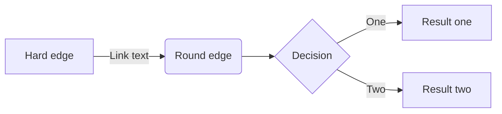

# Unity Game Engine

In this course we'll learn to create programs in the Unity Game Engine

We will use the opensource MonoDevelop IDE (integrated development environment). Another option is to use Microsoft Visual Studio for your development environment.


The GitBook format supports integration of interactive quizes to give you feedback on your understanding of concepts covered in this book. 

Below is an example quiz:
<quiz name="Quiz1">
    <question multiple>
        <p>What is gitbook used for?</p>
        <answer correct>To read books</answer>
        <answer>To book hotel named git</answer>
        <answer correct>To write and publish beautiful books</answer>
        <explanation>GitBook.com lets you write, publish and manage your books online as a service.</explanation>
    </question>
    <question>
        <p>Is this a quiz?</p>
        <answer correct>Yes</answer>
        <answer>No</answer>
    </question>
</quiz>


// This is a hello world program for C.
#include <stdio.h>

int main(){
  printf("Hello World!");
  return 1;
}


``` sequence-hand
Title: Here is a title
A->B: Normal line
B-->C: Dashed line
C->>D: Open arrow
D-->>A: Dashed open arrow
```


