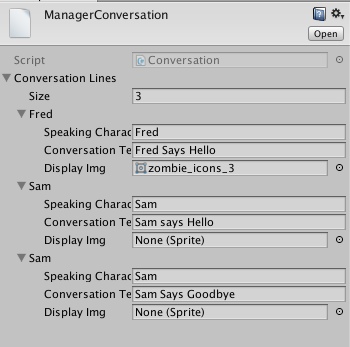
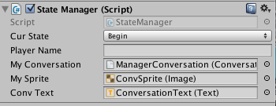

# Conversation Scriptable Objects

### Scriptable Object Factory Unity Package

Lior Tal has created a Unity package that makes it easy to create scriptable object instances.  His website below provides a link to his github account where he provides a download link to the Unity Plugin.  

**Import this Unity Package into a Unity project** and you'll be able to create any scriptableObject using the project-panel's context menu.

[http://www.tallior.com/unity-scriptableobject-factory/](http://www.tallior.com/unity-scriptableobject-factory/)


###Class ConversationEntry

```java
using UnityEngine;
using System.Collections;

[System.Serializable]  //attribute so this custom class can be displayed as an item in the inspector
public class ConversationEntry  {

    public string SpeakingCharacterName;
    public string ConversationText;
    public Sprite DisplayImg;
}
```

###Class ConversationList
This class

```java
using UnityEngine;
using System.Collections;

public class ConversationList : ScriptableObject
{
    public List<ConversationEntry> Conversation;
}
```

### Create a Conversation Asset

To create an instance of a Conversation asset, we right click in the project panel, or right click on the assets folder and select: create -&gt; Conversation, where our custom asset: Conversation, now shows up as an option at the bottom of the menu.  After clicking on Conversation, we now have a new item in our Assets panel, we should give it a unique name so we can reference it in our code.  I've named mine `ManagerConversation`.


### StateManager Conversation Object Instance

Since the StateManager script-component object exists in every scene, for our first attempt at working with a conversation asset, we can add an object-reference to a Conversation object in StateManager.  If we create an instance of a Conversation object in StateManager script: `public Conversation myConversation`, then we can dynamically display conversation data elements, in any scene of our game.  In the inspector, we can drag the newly created ManagerConversation asset to the the myConversation selection box.  Now we have access to get or set these conversation elements. We will need to put this code in a different script, one that isn't a singleton, but is instead associated with a single scene.

```
// in Some script that will go on a gameObject  
    public ConversationList myConversation;  

    //public SpriteRenderer convSprite; // to use a regular image

    public Image mySprite;   // to use a UI sprite

void Start () {
            convText.text = myConversation.ConversationLines[0].ConversationText;
        //convSprite.sprite = myConversation.ConversationLines [0].DisplayImg;
        mySprite.sprite = myConversation.ConversationLines [0].DisplayImg;
    }
```

Here is a view of the Conversation instance attached to a gameObject in the beginScene





