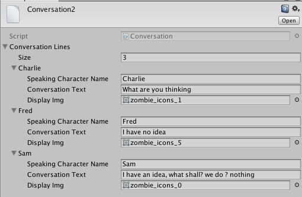

# Conversation
This code below shows how to utilize
 our [Conversation ScriptableObject Custom Asset](https://kdoore.gitbooks.io/cs-2335/content/inventoryitems_-_scriptableobjects.html#conversation-scriptable-objects) from the previous section.
The code chunks below are used to retrieve and display data from a Conversation ScriptableObject: Conversation2.  In these examples, the ScriptableObject is never attached to any scene GameObject, it's just used as a data resource, pulled directly from the project assets.

###Resources Folder
To load a Conversation scriptableObject, which must be located in the Resources folder within Assets, you will need to create a Resources folder and move the desired scriptableObjects into that folder if they are going to be accessed via code and not attached to a gameOjbect via the inspector within a scene.  The code below can also be utilized for Conversation objects that are attached to gameObjects, but controlling via code  is a more flexible approach. 

###Code For Using Conversation Elements
Create a custom script: DialogManager that has 3 gameObjects used to display the content in a conversation element and 2 buttons to allow browsing through the conversation., To load a Conversation scriptableObject, which must be located in the Resources folder within Assets.  In this code below, we're loading The instance of the Conversation:"Conversation2".
```
//DialogManager.cs
//other code is not shown

private Button convBtn, convBackBtn;
private Image cImage;
private Text cText, cName;
private int convIndex;
public Conversation conv2;  //or add in inspector

public void Start (){
/// load conversation asset
		/// 
		conv2=Resources.Load("Conversation2", typeof(Conversation)) as Conversation;
		if (conv2 == null) {
			Debug.Log ("Not loaded");
		} else {
			Debug.Log ("Conversation Asset Loaded, first line of text: ");
			Debug.Log (conv2.ConversationLines [0].ConversationText);
		}
        convIndex=0;

		cText = GameObject.Find ("ConversationText").GetComponent<Text> ();
		cName = GameObject.Find ("ConversationName").GetComponent<Text> ();
		cImage = GameObject.Find ("ConversationImg").GetComponent<Image> ();

		convBtn = GameObject.Find ("ConvButton").GetComponent<Button> ();
		convBtn.onClick.AddListener (getNextConversation);

		convBackBtn = GameObject.Find ("ConvButtonBack").GetComponent<Button> ();
		convBackBtn.onClick.AddListener (getPrevConversation);

		/////show first conversation at start
		if(conv2.ConversationLines.Length != 0){
			convIndex = Utilities.GetConversationEntry (conv2, cName, cText, cImage, convIndex);
		}

	}
	
	public void getNextConversation(){
		Debug.Log ("Next conversation entry" + convIndex);
		convIndex = Utilities.GetConversationEntry (conv2, cName, cText, cImage, convIndex);
	}
	
	public void getPrevConversation(){
		Debug.Log ("Prev conversation entry" + convIndex);
		convIndex = Utilities.GetConversationEntry (conv2, cName, cText, cImage, convIndex-2);
	}

```

###Utilities Static Functions:
This utilities class has a static method that takes as input a Conversation object along with the object references for the UI elements that need to be populated with data.  The this code also includes utility methods to show and hide UI-panels.  The benefit to having these functions on the Utilities class is that they can be accessed from any script in our project. 
```

using UnityEngine;
using UnityEngine.UI;
using System.Collections;

public static class Utilities
{

	public static void ShowPanel (CanvasGroup cg)
	{
		cg.alpha = 1;
		cg.blocksRaycasts = true;
		cg.interactable = true;
	}

	public static void HidePanel (CanvasGroup cg)
	{
		cg.alpha = 0;
		cg.blocksRaycasts = false;
		cg.interactable = false;
	}

	public static int GetConversationEntry (Conversation conversation, Text name, Text text, Image image, int index)
	{
		// how long is our array?
		int numEntries = conversation.ConversationLines.Length;

		index++;  ///increment to move to next element

		//check ranges, constrain to  _index >= 0 && _index <= numEntries-1
        index = (index < 0) ? 0 : index; //ternary operator ?
		index = (index >= numEntries) ? numEntries - 1 : index; 


		//set objectRefs to values
		name.text = conversation.ConversationLines [index].SpeakingCharacterName;
		text.text = conversation.ConversationLines [index].ConversationText;
		image.sprite = conversation.ConversationLines [index].DisplayImg;

		Debug.Log ("Next conversation entry" + index + " name: " + name.text);

		return index;
	}
}

```

