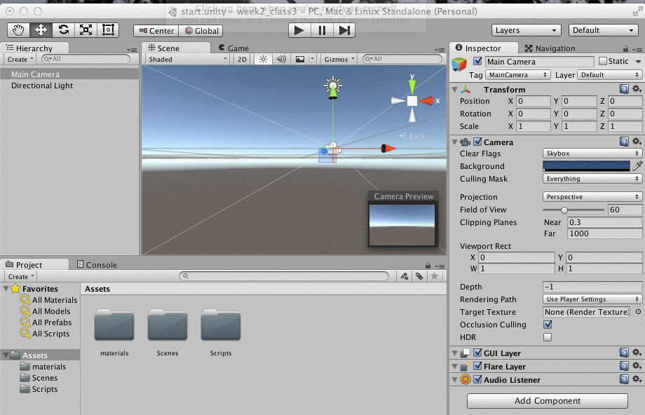

##Create GameObjects and PreFabs

###Prefabs 

###Create Cube GameObject
The animation above shows how to create a cube GameObject.  Then the cube is dragged into the Project Assets Panel, this turns the cube GameObject into a PreFab GameObject.  

###Create CubePrefab
Then, we can drag multiple cubePrefab objects into the scene.  We can add a redMaterial to one cubePrefab, then when we select Apply in the Inspector panel for the prefab object, it applies this material to all prefab instances.  

###Modify Prefab Properties
We can individually modify a prefab instance by creating a green material and then dragging it onto to a CubePrefab instance.  If we don't select 'apply' in the inspector panel, then this change will not be applied to all of the other prefabs.

###Create Complex Object
Next, in order to create a compound object, we create an empty GameObject. We name it 'wall', then select each of the cubePrefab objects in the hierarchy panel and dragging them on-top of the 'wall' item in the hierarchy panel.  This causes these cubePrefab objects to be come child objects of the wall object.  This means that the transform object for each of these prefabs is now defined relative to the parent `wall` object.  If we select the wall object and move it, then we see that all of the cubePrefab child objects move as one compound object.

###Create Controller Script Component

Here is the code that we created to animate the objects in this project. We are attaching this script to a gameObject within our scene and it will modify the position during each Update( ) execution, this allows us to customize movement of gameObjects based on logic within our custom code. 


// This is a script to move a game object along the x axis

using UnityEngine;
using System.Collections;

public class Controller : MonoBehaviour {

	public Vector3 myVector;
    
	// Use this for initialization
	void Start () {
		myVector = new Vector3(1,1,0);
		transform.position=myVector;
		Debug.Log ("MyValue= " + myValue);
	}
	
	// Update is called once per frame
	void Update () {
	     myVector.x += .1f;
	     transform.position=myVector;
	     Debug.Log ("xPosition= " + myVector.x);
	     
	}
}

