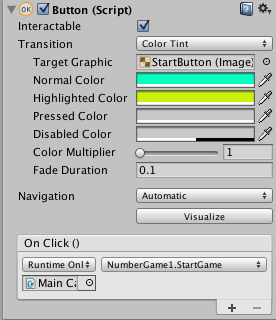
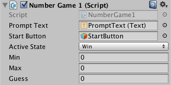

# Event-Driven Number Game

In the previous iterations of the game, we have used the Update() Unity Event function to implement code for control and logic of the game.  In Update() for every frame execution, our code checks the current activeState, then checks for any input that is valid for that state, then we reset the UI-Text elements to the correct values when the activeState changes.  In effect, the only time that we need to change UI-Text element values is when an input event has occurred. 

We can restructure our game so that we use UI-Buttons and the Unity managed: button `on-click` event, then we can eliminate some of the code that's being executed, as we check for valid keyboard input values each frame in the Update function.  

###UI-Button: OnClick Event-Handlers
Unity provides an event system for the Unity User-Interface (UI) components. GameObjects like Button have a Button Component that provides easy configuration to have our custom functions executed when the user clicks on a UI button in our active game scene. 

###Custom Function
In order to add custom behavior to a UI-Button, first we need to write some code that we'd like to have executed when the button has been clicked.  For our number game project, we can add a start game button that the user will click to indicate that they want to play the game.  Currently, we prompt the user when they are in the Initialize GameState to enter 'Y' if they went to play, or to enter 'N' to quit.  So, we have the following logic in our code, where we are listening for 'Y' when the activeState = GameState.Initialize:
```C#
	 void Start () {
        min = 0;
        max = 64;
        guess = (min + max) / 2;
        activeState = GameState.Initialize;
        Debug.Log("Do you want to play a Game, if so enter Y, else enter N");
        gameText.text = "Do you want to play a Game, if so enter Y, else enter N?";  //ui text prompt
    }
	
	void Update(){
	if (activeState == GameState.Initialize) {
			
			if (Input.GetKeyDown (KeyCode.Y)) {
				Debug.Log ("Think of a number between " + min + " and " + max + " press Enter when ready");
				activeState = GameState.Start;
			} 
			if (Input.GetKeyDown (KeyCode.N)) {
				Debug.Log ("No game today");
				activeState = GameState.End;
			}

		}
		
		///other code
	} //end Update()

```

So, we need to refactor our program and move code out of the Update function.  We also need to change the prompt in the Start function so the user knows to press the button to start the game.

```C#
gameText.text = "Do you want to play a Game, if so press the Start Game button, else enter N?"; 


//remove this code from update since we're no longer testing for input of 'Y' during gameState.Initialize

if (Input.GetKeyDown (KeyCode.Y)) {
				Debug.Log ("Think of a number between " + min + " and " + max + " press Enter when ready");
				activeState = GameState.Start;
			} 

```
We move the inner code into a new public function: StartGame()
```
public void StartGame(){
		activeState = GameState.Start;
		Debug.Log ("Think of a number between " + min + " and " + max + " press Enter when ready");
		promptText.text = string.Format ("Think of a number between {0} and {1} \n press Enter when ready", min, max);
	}

```
In Unity, we need to add a UI-Button GameObject to the scene.  We'll want to set custom values for highlight and normal colors so we can verify the button responds to mouse interaction when we hover over it during game-play mode.

Then we need to add our custom function as a OnClick( ) event handler for the button.  The image below shows that we have clicked the `+` symbol below OnClick, that has opened a selector to identify the GameObject that has an attached script component with our custom function.  Since our script component: NumberGame1.cs is on the MainCamera, then we select that object.  This gives us a drop-down selector to select the script, and from there we can select our custom function.  It's important to make sure we've declared the custom function as public, otherwise it won't show up in the inspector drop-down list.  Once we select the correct function, our button should execute this fuction when clicked.  



###Hide Button after Use
In order to hide the button after we've used it, we need to have a reference to the button in our code.  To do that, we need to create a public variable that is type: GameObject, then we'll connect that in the inspector to the Button gameObject in our scene: 

```
public GameObject startButton;
```
Connect the Script Variable: StartButton with the scene: GameObject by dragging the StartButton to the placeHolder space on the NumberGame script component that is attatched to the MainCamera GameObject.



Then in our code: Once the button has been clicked, and we've executed our StartGame tasks, then we can set the StartButton variable to inactive: 

```C#
public void StartGame(){
		activeState = GameState.Start;
		Debug.Log ("Think of a number between " + min + " and " + max + " press Enter when ready");
		promptText.text = string.Format ("Think of a number between {0} and {1} \n press Enter when ready", min, max);
		startButton.SetActive (false);  //This in activates the button.
	}
	
```	
