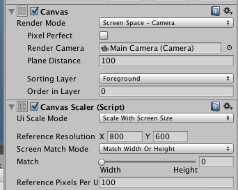

# Game Scene

To build on our project, we will add some scenes with game activities.  This will provide us with an opportunity to write code that deals with dynamic game objects that interact with each other.  We'll create a very simple 2D game that has a simple sprite character that can collide with objects to generate some dynamic game data that we'll want to display in other scenes.

So far all of our scenes have been UI scenes which relied on using Canvas GameObjects.  In these scenes, we have the Canvas Component

