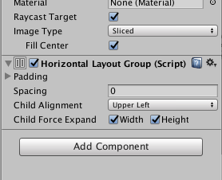
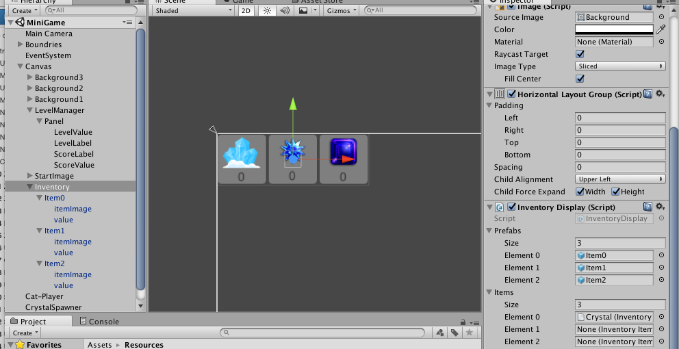

# Inventory Display

In this section, we create a set of gameObject panels that we can use to show the inventory of items that the player has collected during the game.

THe first step to creating an inventory display is to create a single UI panel that can function as the template for displaying your inventory items.  This can be used to create a prefab that can be customized to display each type of collectable object.

The image below shows the panels are contained within a larger-panel, and that parent panel has a Layout-Component: Horizontal Layout Group




The parent panel has several child panels, each of which contain a UI-image and UI-text.  The Horizontal Layout Group 




###Inventory Display: 

```C#
using UnityEngine;
using UnityEngine.UI;
using System.Collections;
using System.Collections.Generic;


public class InventoryDisplay : MonoBehaviour
{

	public List<GameObject> prefabs;
    
	// Use this for initialization
	void Start ()
	{
		//prefabs = new List<GameObject> ();
		for (int i = 0; i < prefabs.Count; i++) {
			prefabs [i].SetActive (false);
		}
        // register function as subscriber for onPlayerDataEvent
		GameData.instanceRef.onPlayerDataUpdate += updateInventoryDisplay;
	}

	public void updateInventoryDisplay (object s, PlayerDataEventArgs e)
	{
		Dictionary<PickupType, int> inventory = GameData.instanceRef.inventory;

		foreach (var item in inventory) {
			UpdateUI ( item.Key, item.Value); 
			Debug.Log ("item Count " + item.Value);
		}
	}

	void UpdateUI ( PickupType item, int val)
	{
		Text temp;  //UI text reference
		switch (item) {

		case PickupType.crystal:
			if (val > 0) {
				prefabs [0].SetActive (true);
				temp = prefabs [0].GetComponentInChildren<Text> ();
				temp.text = string.Format ("{0}", val);
			} else {
				prefabs [0].SetActive (false);
			}

			break;

		case PickupType.star:
			if (val > 0) {
				prefabs [1].SetActive (true);
				temp = prefabs [1].GetComponentInChildren<Text> ();
				temp.text = string.Format ("{0}", val);
			} else {
				prefabs [1].SetActive (false);
			}
			break;

		case PickupType.purpleGem:
			if (val > 0) {
				prefabs [2].SetActive (true);
				temp = prefabs [2].GetComponentInChildren<Text> ();
				temp.text = string.Format ("{0}", val);
			} else {
				prefabs [2].SetActive (false);
			}
			break;

		}
	}

}
```

