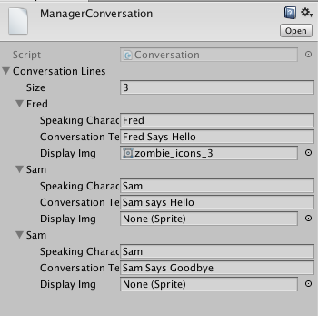
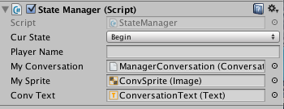

# InventoryItems - ScriptableObjects

Creating a Scriptable Object allows for us to create a complex data-type that can be saved by the Unity Engine separate from any gameObject.  This will allow us to create InventoryItems that we can use across a varitey of Scenes and that we can import into other projects as assets.  Each instance of an InventoryItem that we create is stored as a separate project asset.  

```
using UnityEngine;

[System.Serializable]
public class InventoryItem : ScriptableObject
{
    public PickUp.PickUpType pickupType;
	public Sprite Sprite;
	public Vector3 Scale;
	public string ItemName;
	public int Cost;
	public int Strength;
	public int Defense;
}
```
The following class allows us to create InventoryItems in as an Asset. Scriptable Objects can be saved independently of any particular gameObject.  This code must be placed in a folder named Editor within the Assets/Scripts/ folder.  

```
using UnityEngine;
using UnityEditor;

public class InventoryItemManager : MonoBehaviour {
	
	[MenuItem("Assets/Create/InventoryItem")]
	public static void CreateAsset()
	{
	
	    InventoryItem inventoryItem = ScriptableObject.CreateInstance<InventoryItem>();
	    
		//Create a .asset file for our new object and save it
		AssetDatabase.CreateAsset(inventoryItem, "Assets/newInventoryItem.asset");
		AssetDatabase.SaveAssets();
		
		//Now switch the inspector to our new object
		EditorUtility.FocusProjectWindow();
		Selection.activeObject = inventoryItem;
		//CustomAssetUtility.CreateAsset<InventoryItem>();
	}
}
```

###Conversation Scriptable Objects:

Class ConversationEntry
```
using UnityEngine;
using System.Collections;

[System.Serializable]  //attribute
public class ConversationEntry  {

	public string SpeakingCharacterName;
	public string ConversationText;
	public Sprite DisplayImg;
}
```


Class Conversation
```
using UnityEngine;
using System.Collections;

public class Conversation : ScriptableObject {

	public ConversationEntry[] ConversationLines;
}
```

Editor Code: ConversationManager
```
using UnityEngine;
using UnityEditor;

public class ConversationManager : MonoBehaviour {

	[MenuItem("Assets/Create/Conversation")]
	public static void CreateAsset(){

		Conversation conversationManager = ScriptableObject.CreateInstance<Conversation> ();

		AssetDatabase.CreateAsset (conversationManager, "Assets/newConversationManager.asset");
		AssetDatabase.SaveAssets ();

		EditorUtility.FocusProjectWindow ();
		Selection.activeObject = conversationManager;
	}
}
```
###Create a Conversation Asset
To create an instance of a Conversation asset, we right click in the project panel, or right click on the assets folder and select: create -> Conversation, where our custom asset: Conversation, now shows up as an option at the bottom of the menu.  When we click on 


If we create an instance of a Conversation in StateManager, then we can dynamically display conversation data elements.

###StateManager Conversation Object Instance

Since the StateManager script-component object exists in every scene, for our first attempt at working with a conversation asset, we can add an object-reference to a Conversation object in StateManager.  If we set it as public, then we can drag the Conversation asset to the 

```
// in StateManager
	public Conversation myConversation;  

    //public SpriteRenderer convSprite; // to use a regular image

    public Image mySprite;   // to use a UI sprite

void Start () {
		activeState = new BeginState (this);
		curState = GameState.Begin;
		activeState.InitializeObjectRefs ();
		convText.text = myConversation.ConversationLines[0].ConversationText;
		//convSprite.sprite = myConversation.ConversationLines [0].DisplayImg;
		mySprite.sprite = myConversation.ConversationLines [0].DisplayImg;
	}
```

Here is a view of the Conversation instance attached to StateManager in the beginScene



