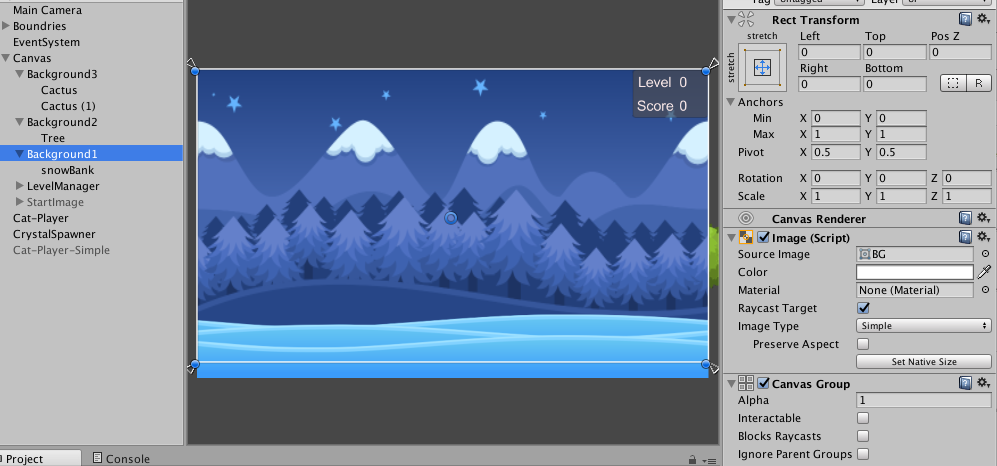

# Level Manager

Within the MiniGame, we'd like to have several levels of play. Level is an abstract concept, in this gaming context, what do we mean by several levels of play?  We'd like to break the game-experience into meaningful chunks, this will let the player know they have attempted to complete a task, and the game should provide some feedback to indicate their level of success in this challenge.

In this course, we are focused on the functional and structural design of the layer-change event logic.  The dynamic logic can be structured using a finite state machine, since the level logic is event driven and since the game-system can only be in a single state at any time.   One question we might ask is how can we integrate feedback to enhance player learning using an FSM system model?  

For a mini-game that uses a single scene to implement a series of game-levels, we can use a lightweight Finite State Machine - where we define an enum: LevelState to define a set of states that the mini-game system can be in.  We'll put this code in the LevelManager.cs script file.

```java
public enum LevelState
{
	Start,
	Level1,
	Level2,
	Level3,
	Win,
	End
}
/// inside LevelManager Class

public LevelState curLevel;  //declare a LevelState variable to store the active state

``` 

We can use the Start state to allow for a Splash screen and start-button event to trigger the start of the miniGame, or we can start the game-play use the LevelManager Class's Start( ) method.  The transtion between levels is managed by the NextLevel() function which is triggered when the PlayerDataUpdate event is broadcast from the GameData component object;

```java
/// Inside LevelManager.cs class script
void Start ()
	{
         curLevel = LevelState.Start;  ///initialize curLevel
		crystalSpawner = GameObject.Find ("CrystalSpawner").GetComponent<CrystalSpawner> ();

		nextLevel ();  //starts the game -
	}

```


###Finite State Machine Logic - nextLevel( )

The nextLevel() function provides the FSM logic for the Level management.

```C#

void nextLevel ()
	{
		switch (curLevel) {
		case LevelState.Start:
			Debug.Log ("State changed - goto :LoadLevel 1");
			curLevel = LevelState.Level1;
			LoadLevel1 ();
			break;
		case LevelState.Level1:
			curLevel = LevelState.Level2;
			LoadLevel2 ();
			break;
		case LevelState.Level2:
			curLevel = LevelState.Level3;
             //add code here
			break;
		case LevelState.Level3:
			curLevel = LevelState.Win;
             //add code here
			break;
		case LevelState.Win:
			curLevel = LevelState.End;
            // add code here
			break;
		case LevelState.End:
            //add code here
			break;
		} // end switch
        
	} // end function

```

#Level-Change Behaviors
The nextLevel() method provides the FSM structure to manage state-change logic, so now we just need to decide what to change in the game-scene when this level-change event occurs.
One simple change to implement is toggling visibility of different background sprites.  An easy way to implement this is to make sure the background images are UI canvas images, this will allow us to toggle the CanvasGroup component's alpha and interactivity properties.  

The screen-shot below shows a series of background gameObjects, these are Canvas UI>Image objects that have a CanvasGroup component.  Below we'll show the code that corresponds to how we can toggle the background visibility when the level changes.



