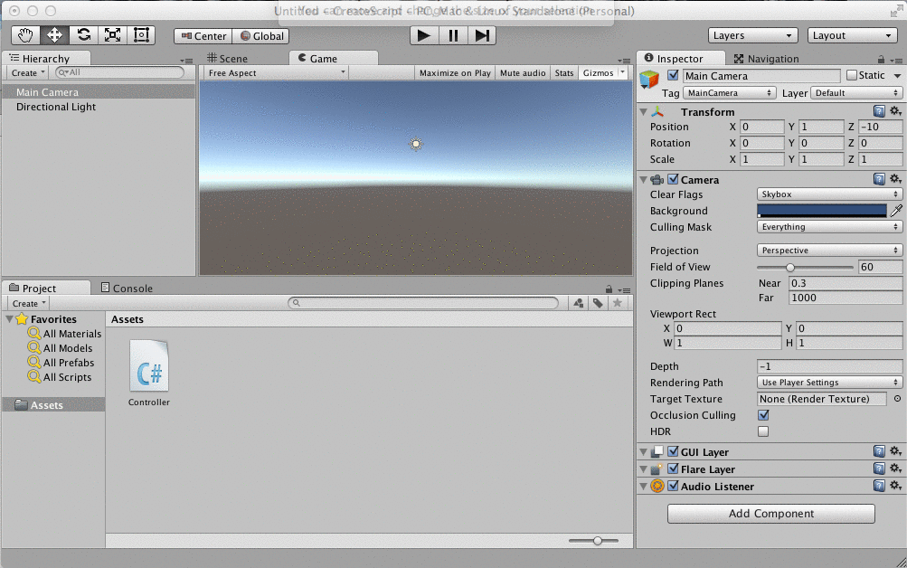

# MonoBehaviour


MonoBehaviour is a C# class that is part of the Unity Engine.  Almost all of the C# classes that we create will inherit from the MonoBehavior class.  This inheritance relationship means that our script component objects can be attached to Unity GameObjects and their Start() and Update() methods will be executed when our GameObject is part of the currently active Unity Scene. 

## C\# Inheritance
The Syntax for indicating that a class inherits from a base class in C# is shown below, the colon : is used to indicate both inheritance from a base class and it also indicates that our custom class will be implementing an interface.  We'll discuss interfaces later in the course.  For now it's important to note that in C#, a class can only inherit from a single base class, but a class can implement multiple interfaces.  
```
public class myClass : BaseClass, ISomeInterface, ISomeOtherInterface{  //single level of inheritance, unlimited interface implementation, a comma separated list.
    
}
```

##Script Component Object
When we want to create a C# script to add or control behaviors of a game object, there are many different ways that we can create a C# script. The most common approach is to have our custom class inherit from MonoBehaviour however, there are several other ways to have our script integrated within Unity so it can be instantiated and executed as part of our game's code execution, we'll look at these other approaches later in the course.


#Script Components - Unity Code Files
To edit a script in Unity, first create a **_script component object_** inside Unity. You can right-click in the Make sure to name the file correctly when creating it in Unity because the script name is used to create the class name of the C# class that is created for each Unity script component.

Most of the code that we write for this course will end up being attached to gameObjects within the Unity Editor.

###Sample Code:
The code section below is a very basic C# script, *Example.cs*. This creates a C# ``class Example``, which inherits from the ``MonoBehavior`` class. When creating a C# script object, some code is automatically generated in the file when it's created, this includes the MonoBehaviour Start() and
Update() functions, the Debug.Log() content has been added to the following script to create custom behavior.

```
using UnityEngine;
using System.Collections;
public class Example: MonoBehaviour {
//Use this for initialization
void Start () { //this code is executed one time
Debug.Log("Initialization has occured");
}
//Update is called once per frame
void Update () { //this code is executed once each frame
Debug.Log("Update Called");
}
}```


##Create Script in Unity
In the animation below, we create a C# script, name it "Controller", and then we double-click the script. This opens the script in either MonoDevelop or Visual Studio, where we can see that code for the Start() and Update() functions is already included in the file. We see that we've created a ``class Controller`` that inherits from the ``MonoBehavior`` class. When we create a public variable, then that variable shows up in the inspector panel in the Unity Editor, so we can easily modify that value.

##Attach Script to Camera Object
In the animation below, we select the main camera in the Hierarchy panel, then in the inspector panel we select 'Add Component', then we select 'script'. This lets us select the script that we've already created. When we push play, the script is executed and we see the ``Debug.Log()`` output in the console panel. The Console provides a good way to get information about our program during it's execution.



<quiz>
 <question>
        <p>What is MonoBehavior?</p>
        <answer correct>A base-class for custom-script component classes to add custom behaviors to Unity game objects</answer>
        <answer>A C# interface for that provides Start() and Update() hooks for Unity game objects  </answer>
        <answer>A type of illness that causes fatigue which results from too much time spent programming C# scripts for Unity game objects </answer>
    </question>
    </quiz>
    