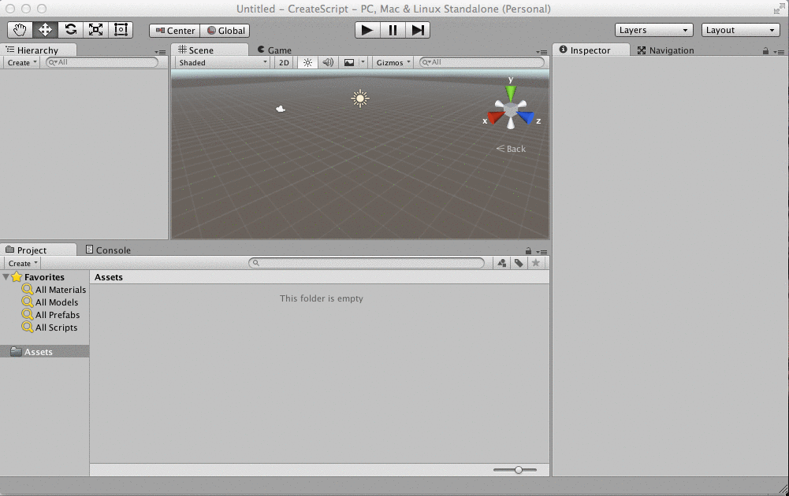
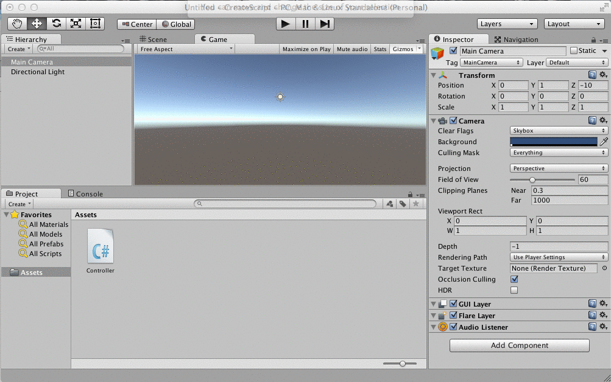

#MonoDevelop

MonoDevelop an Integrated Development Environment (IDE) that is installed as part of the Unity 5 installation.  It is an open-source IDE that is integrated to work with the Unity Editor.

To edit a script in MonoDevelop, first create a script component object inside Unity.  Make sure to name the file correctly when creating it in Unity because the script name is used to create the class name of the C# class that is created for each Unity script component.  

Most of the code that we write for this course will end up being attached to gameObjects within the Unity Editor.  

###Sample Code:  
The code section below is a very basic C# script, *Example.cs*.  This creates a C# ``class Example``, which inherits from the ``MonoBehavior`` class.  When creating a C# script object, some code is automatically generated in the file when it's created, this includes the MonoBehaviour Start() and 
Update() functions, the Debug.Log() content has been added to the following script to create custom behavior. 

```
using UnityEngine;
using System.Collections;
public class Example: MonoBehaviour {
       //Use this for initialization
       void Start () {  //this code is executed one time
            Debug.Log("Initialization has occured");
       }
       //Update is called once per frame
       void Update () {  //this code is executed once each frame
            Debug.Log("Update Called");
        } 
}```


##Create Script in Unity
In the animation below, we create a C# script, name it "Controller", and then we double-click the script. This opens the script in MonoDevelop, where we can see that code for the Start() and Update() functions is already included in the file.  We see that we've created a ``class Controller`` that inherits from the ``MonoBehavior`` class.  When we create a public variable, then that variable shows up in the inspector panel in the Unity Editor, so we can easily modify that value.
    

    
##Attach Script to Camera Object
In the animation below, we select the main camera in the Hierarchy panel, then in the inspector panel we select 'Add Component', then we select 'script'. This lets us select the script that we've already created.  When we push play, the script is executed and we see the ``Debug.Log()`` output in the console panel.  The Console provides a good way to get information about our program during it's execution.
