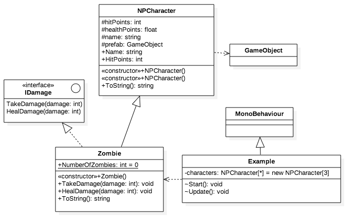

# Non-Player Character: Base-Class

            
###Zombie's Base-Class: NPCharacter
If we realize that we're likely to have other classes that represent similar objects to Zombies, it would then make sense for use to define a Base-Class for all similar types of objects.  We can consider that zombies might be part of a larger classification of non-player-characters (NPC) that we'd have in a game, we can imagine we'll have other NPC types in our program.  It will be helpful to be able to group these similar objects in a collection, and if we make all similar classes inherit from the same base-class this will make it easy to manage a group of these similar objects.  


###Non-Player-Character: Base-Class
Since we've already created a Zombie class, it will be relatively easy to determine the required class: instance-variables and class methods that we'd need for a base-class that would be a parent-class for Zombies and other NPCs.  We can actually remove code from the zombie class and place that code directly in the NPCharacter base class, then all similar child-classes will inherit the same base-class instance-fields and methods.  The code below defines the NPCharacter Class:

```java

using UnityEngine;
using System.Collections;

public class NPCharacter: IDamage { //implement IDamage in the base class

    //Class Fields or Instance Variables
	
	private int hitPoints;  //use Property in child classes to modify hitPoints
	private float healthPoints;
	protected string name;
	protected GameObject prefab;

    //Properties

	public string Name{  //property
		set {
			name = value;
		}
		get{
			return name;
		}
	}

	public int HitPoints{       //we can use properties to do additional tasks when this modify event was triggered somewhere else in the game
		set{
			hitPoints = value;
			healthPoints -= value;
			Debug.Log ("NPC modify HitPoints " + hitPoints);
			}
		get{
			return hitPoints;
		}
	}
	
    ///Constructors
    
	public NPCharacter( ){    ////we must define a default constructor 
		hitPoints=0;
		healthPoints = 30;
		name = "No Name";
		Debug.Log ("Default Constructor for NPC is called");
	}
	public NPCharacter(string n, int hp){    ////other constructor
		hitPoints=hp;
		healthPoints = 0;
		name = n;
		Debug.Log ("Constructor for NPC is called");
	}

    //This method will be overridden in Zombie but not in Kitten child class
	public virtual void doSomething(){
		Debug.Log ("Do Something in the BaseClass");
	}

//IDamage Interface Methods
	public void TakeDamage(int damage){
		HitPoints -= damage;
		Debug.Log ("taking damage " + HitPoints);
	}

	public void HealDamage(int damage){
		//hitPoints += damage;
	}

	public override string ToString ()
	{
		return string.Format ("NPC Name: {0}, HitPoints {1}", name, hitPoints);
	}
}

```
###Protected Access Modifier:
Notice that we have changed the access modifier for each of the class-instance/field variables.  When these were part of the Zombie class, we had them as private to enforce encapsulation and restrict access and modification of these variables.  However, using the private access modifier also restricts access to these variables even for child-classes.  It might make sense that we need access to these variables within a child class so the `protected` access modifier is designed specifically for this purpose. 

###Modified Zombie as a Child Class of NPCharacter
```
using UnityEngine;
using System.Collections;


public class Zombie: NPCharacter{

	public static int NumberOfZombies = 0;
	private int brainsEaten;

	//BrainsEaten should only be associated with the Zombie class, not the Base class
	public int BrainsEaten{
		get{
			return brainsEaten;
		}
		set{  ///properties give opportunity to modify other values and call methods
			brainsEaten = value;
			healthPoints += (value * 0.5f);  //zombie health increases
			Debug.Log("HealthPoints after eatingBrains " + healthPoints);
		}
	}

	public Zombie(){
		Debug.Log ("Default Constructor for Zombie is called");
	}

	public Zombie( string n, int hp): base(){ // explicitly call default base-class constructor
		
		NumberOfZombies++;  //class level variable
		name = n;
		HitPoints = hp;
	
		prefab = GameObject.Instantiate (Resources.Load ("Zombie")) as GameObject;
		prefab.transform.position= new Vector3 (Random.Range (-5, 5), 0, Random.Range (-5, 5));

		Debug.Log ("Constructor for Zombies is called");
	}

	public void EatBrains(int numBrains){
		BrainsEaten += numBrains;
		Debug.Log ("This is a zombie specific method");
	}

	public override void doSomething(){
		Debug.Log ("Method doSomething: Override in the Zombie Child Class");
	}
		

	public override string ToString ()
	{
		return string.Format ("Zombie Name: {0}, HitPoints {1}", name, HitPoints);
	}

}
```

###Kitten Child Class
The code below shows how easy it is to create additional child-classes once we've defined the NPCharacter base class.  We'll need to look at what happens if we don't implement the doSomething() method that is defined as virtual in the base class.  

```
using UnityEngine;
using System.Collections;

public class Kitten : NPCharacter {

	public static int NumberOfKittens = 0;

	private int milkCartons;

	//BrainsEaten should only be associated with the Zombie class, not the Base class
	public int MilkCartons{
		get{
			return milkCartons;
		}
		set{  ///properties give opportunity to modify other values and call methods
			milkCartons = value;
			healthPoints += (value * 0.5f);  //zombie health increases
			Debug.Log("HealthPoints after milkCartons " + healthPoints);
		}
	}

	public Kitten(){
		healthPoints = 20;
		name = "Kitty";
		HitPoints = 5;
		NumberOfKittens++; 
		Debug.Log ("Default Constructor for Kitten is called");
	}

	public void DrinkMilk(int milk){
		milkCartons += milk;
		Debug.Log ("This is a Kitten specific method");
	}

	public override string ToString ()
	{
		return string.Format ("Kitten Name: {0}, HitPoints {1}", name, HitPoints);
	}
}
```

###UML Diagram

The diagram below shows the Unified Modeling Language model for the classes for this stage of our project.  UML class diagrams provide a visual overview of the relationships between classes, interfaces, and the features: variables and methods for each of these classes.  




