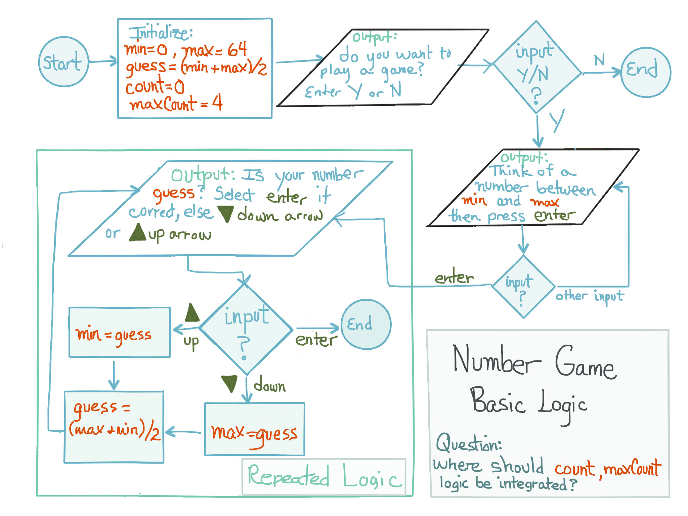

#Number Game
We've all played a number-guessing game, where one player thinks of a number within in a given range of integers and the other player must guess the number in as few guesses as possible.  Let's look at how we can create a similar game using Unity.

###Console Game
For the first iteration of this game, we'll design the game to run in the console, where we have text prompts to accept user input. The computer makes guesses and the user selects either the up-arrow, down-arrow to indicate the number is higher or lower than the current guess.  If the computer selects the correct answer, then the user hits the return/enter key, and the game starts over.  

###Binary Search
We will write the program so that the computer makes the minimum number of guesses.  First, it is important to note that when selecting a number that falls within a specific range of numbers, we are talking about integer numbers and we are considering that they have their natural ordering: `we are searching a sorted list of values`.  At each step, the computer makes a guess that splits the number range in half, by picking the value at the midpoint of the range. This guessed value corresponds to the  (max + min) / 2.  If the guessed, midpoint value does not match the player's selected number, then we ask the player whether their number is higher or lower than the current guessed value. Then we need to reset the endpoints of the search range so that the endpoints match this new, smaller range. If the user's number is higher than the computer's guess, then we need to set the new minimum of the new range to the current guessed value `min = guess`.  So, at each step in binary search, the number of possible values is divided in half, therefore, the maximum number of tries that the computer must make is   log - base 2 of the initial range plus one: $$log_2(n)+1$$.  

    *"Although the basic idea of binary search is comparatively straightforward, the details can be surprisingly tricky…" — [Donald Knuth](https://en.wikipedia.org/wiki/Binary_search_algorithm#Number_guessing_game)*


For an initial range of 64, the computer will make no more than 7 guesses since 2 to the 6th power is 64. 

We walked through the logical design of the project code in class by first creating a logic flow diagram, a simplified version is shown below.  In the diagram below we have identified the section of logic that must be repeated for each round of the game, that code will need to be executed using the Unity Update() function.



Based on the flow diagram, we implemented code in C# in monoDevelop and we attached the code to the main-camera in the default scene.  


```
using UnityEngine;
using System.Collections;

public class NumberGame : MonoBehaviour {
		int min, max, guess;
		
	// Use this for initialization
	void Start () {
		StartGame();
		}
	
	
	// Update is called once per frame
	void Update () {
		if(Input.GetKeyDown(KeyCode.UpArrow)){  //guess is too low
			min=guess;
			NextGuess();
		}
		else if(Input.GetKeyDown(KeyCode.DownArrow)){  //guess is to high
			max=guess;
			NextGuess();
		}
		else if(Input.GetKeyDown(KeyCode.Return)){ //computer wins!
			print("I won, I'm brilliant");
			StartGame();  //restart game
		}
			 
	}
	
	void StartGame(){  //initialization of values and game prompts
		min=0;
		max=100;
		guess=(min+max)/2;  ///initial guess - binary search algorithm
		print("Do you want to play a game?");
		print("Think of a number between " + min + " and " + max);
		print("Is the number higher or lower than " + guess + " ?");
		print("'up-arrow' for higher, 'down-arrow' for lower, 'enter' for equal");
	}
	
	//Calculate next guess and generate next game prompts
	void NextGuess(){
		guess=(min+max)/2;
		print("Is the number higher or lower than " + guess + " ?");
		print("'up-arrow' for higher, 'down-arrow' for lower, 'enter' for equal");
	}
}
```

###Questions
Can you extend this program so that:
- Use User-Interface Text GameObjects for player interaction?
- Implement a counter variable to insure the computer doesn't always win the game.
- Check for `plus-one` type errors: does our method insure that the endpoints of the range can be selected as valid selections?  
- Is integer division negatively impacting our program?  If our range of numbers is 1 to 4, and we select number 4, what is the progression of values for: min, max, guess, and input
    
| Min | Max | Guess | Input |
| -- | -- |
| 1 | 4 | ( 1 + 4 ) / 2 = 2 | Higher |
| 2 | 4 | ( 2 + 4 ) / 2 = 3 | Higher |
| 3 | 4 | ( 3 + 4 ) / 2 = 3 | Higher |
| 3 | 4 | ( 3 + 4 ) / 2 = 3 | Higher |

As demonstrated above, the computer will never be able to select the value **4** as the correct guessed value.  How can we fix this?


