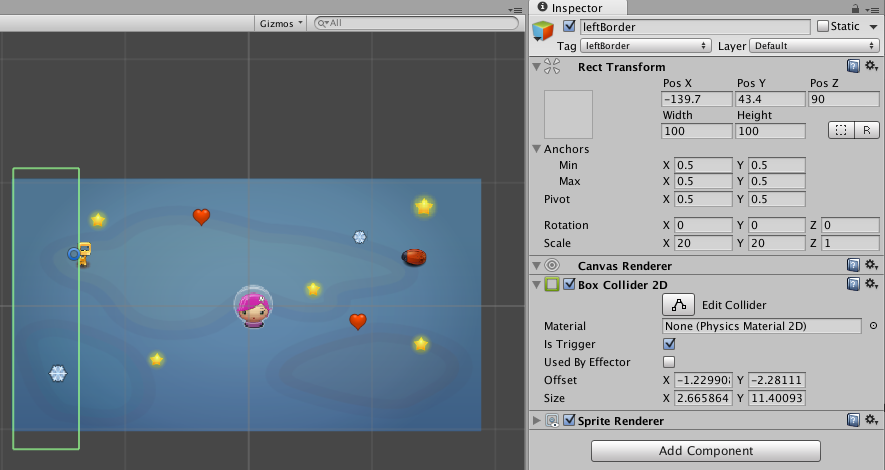

#Player GameObject

### 2D Sprite as Player 
To create a player character, we need to create a gameObject =>  2D Sprite. Then, we can set the sprite-Renderer component to refer to an image that we've added to our project assets folder.  To import an image as a 2D sprite, you select the image in the assets panel and set the component: texture-type set to *Sprite(2D - UI). 

Below are some example open-source game sprites that you can download to use in your proejct, these sprites are from: :


Then we need to attach a RigidBody2D component to our Girl-player.  The [Unity Manual](http://docs.unity3d.com/ScriptReference/Rigidbody2D.html) explains that we need to add a RigidBody2D component so that we can use the Unity Physics Engine to move our Girl-player in the scene.  We'll update the player's RigidBody.velocity each frame in response to the user key-presses. In addition, the Rigidbody component allows us to sense when our player collides with other game objects.

###Canvas Mode:  Screen-Space Camera
Since we are using sprites to create a game in this scene, we'll need to change our camera settings to allow us to also use UI-objects that will be on a Canvas GameObject. Add a UI-Text GameObject to the scene.  If you double click on your text, you'll see that the scaling for the canvas does not match the scaling for the sprites we've used to create the scene.

###Custom Sorting Layers

We need to define sorting layers for our sprites, this will allow us to define layers that vary in Z depth. First we need to select the layer dropdown tab from the top of the inspector panel and then we choose to add new layers.  We select to add new sorting layers, we create a Background and a Foreground sorting layer.  The ordering of the layers in this list defines the ordering of layers in our scene. Then for each GameObject that we assign with *Sorting Layer Background* those objects will be behind the GameObjects that have been assigned to the Foreground Layer.  We can define additional layers, and we can change the layer ordering dynamically using C# scripts.  (We don't do that in this project)
In addition, the Z transform value for an object can also determine visibility.  The Main Camera has a transform position vector of (0,0,-10) by default.  This means that to move objects closer to the camera, can give them a Z transform value that is between 0 and -10. 


###RigidBody2D

In the PlayerMove code below, we write code to allow the user to move the player using various input methods. We're using the UnityEngine Input default mappings so we want to provide access to move the player along the horizontal and vertical axis.  We need to use a RigidBody2D  component because it allows us to use UnityEngine physics engine to create realistic character movement.  

[Unity RigidBody Documentation](http://docs.unity3d.com/Manual/class-Rigidbody.html)
 Rigidbodies enable your GameObjects to act under the control of physics. The Rigidbody can receive forces and torque to make your objects move in a realistic way.
[Rigidbody 2D](http://docs.unity3d.com/Manual/class-Rigidbody2D.html), the difference that in 2D, objects can only move in the XY plane and can only rotate on an axis perpendicular to that plane.  Remember to set gravity to 0 if you don't want it to impact your objects.

###Colliders

[Collider interactions](http://docs.unity3d.com/Manual/CollidersOverview.html)  Colliders interact with each other differently depending on how their Rigidbody components are configured. The three important configurations are the Static Collider (ie, no Rigidbody is attached at all), the Rigidbody Collider and the Kinematic Rigidbody Collider.  Collider Components define the shape of an object for the purposes of physical collisions. A collider, which is invisible, need not be the exact same shape as the object’s mesh and in fact, a rough approximation is often more efficient and indistinguishable in gameplay. A GameObject that has a Collider but no RigidBody component will act like an immovable object that other objects can run into.  When isTrigger is selected, then the collider does not show collision behavior, instead, an event is generated that can be used to execute related actions or behaviors.
   

###Player Move Code:  Attached to the Girl Sprite:

PlayerMove.cs

```
using UnityEngine;
using System.Collections;

public class PlayerMove : MonoBehaviour {
  public float speed = 10;   //initialzation should be moved to Start()
  private Rigidbody2D rigidBody2D;

  void Awake(){
    rigidBody2D = GetComponent<Rigidbody2D>();
  }

  void FixedUpdate(){
    float xMove = Input.GetAxis("Horizontal");
    float yMove = Input.GetAxis("Vertical");

    float xSpeed = xMove * speed;
    float ySpeed = yMove * speed;
    
    Vector2 newVelocity = new Vector2(xSpeed, ySpeed);
    
    rigidBody2D.velocity = newVelocity;
  }
}
```

###Player Controller Script

Player.cs - This is the starter version of the Player script, modifications will be made to include: testing to see if a "Bug" was the collision trigger.

```
using UnityEngine;
using System.Collections;
using UnityEngine.UI;

public class Player : MonoBehaviour {
    
    private bool carryingStar=false;
	private bool initialized=false;
	public int starScore=0;  //initialize from manager data?
	public int numStars;
    private StateManager manager;
	
	
	void Start(){  //initialize object refs within a scene in Start()
	    	manager=GameObject.Find ("GameManager").GetComponent<StateManager>();
	}

    void OnTriggerEnter2D(Collider2D hit){
        if(hit.CompareTag("Star")){
                carryingStar=true;
                numStars++;
                manager.numStars++;
                Debug.Log ("on trigger " + numStars);
                UpdateStarText();
                Destroy(hit.gameObject);
        }  // add code to test for other collision triggers
    }
   
    
    public void Update(){
    
    }
  
    private void UpdateStarText(){
            string starMessage= "no stars ;-(";
            
            if(carryingStar){
			starMessage = "Carrying " + manager.numStars + " stars ;-)";
            }
           // starText.text= starMessage;
    }
}

```
[Link to LostGarden SpaceGame Zipfile](https://utdallas.box.com/LostGardenSprites)


###Move Script - For Bug Movement
```
using UnityEngine;

/// <summary>
/// Simply moves the current game object
/// </summary>
public class MoveScript : MonoBehaviour
{
	public float speed;
    private Vector2 direction;
	private Vector2 position;
	private Vector2 movement;
	private Rigidbody2D  rb2D;
	private Vector3 LowerLeft;
	private float curX;
	private float spriteDirection;
	
	void Start(){  //initialize values in Start to override inspector default values
		speed=20f ;
		spriteDirection= transform.localScale.x;  //what is the initial value of scale.x which controls size and orientation of sprite
		
		direction = new Vector2(-1, 0);
		rb2D=this.GetComponent<Rigidbody2D>();
		LowerLeft=Camera.main.ScreenToWorldPoint(new Vector3(0,0,0));
		UpperRight=Camera.main.ScreenToWorldPoint (new Vector3(Screen.width, Screen.height, 0));
		
		Debug.Log("lowerLeft.x " + LowerLeft.x);
		Debug.Log ("UpperRight.x" );  //add code to test for collision with right screen edge.
	}
	
	void FixedUpdate()
	{
	    // check current x position of object
		curX= transform.localPosition.x;  //what is current x position?
		
		//if we have hit the left screen edge change direction of speed
		if(curX < LowerLeft.x){
		     speed *= -1;
		}   
		
		//add code here to test for collision with right screen edge
		
		//can we add code to flip the image sprite direction?
		
		movement = new Vector2( 
				speed * direction.x,
				speed * direction.y
				);
		// Apply movement to the rigidbody
		
		rb2D.velocity = movement;
	}
}
```
###GameState.cs
We need to have a C# State class associated with each scene in our adventure. For this scene, we'll dyamically modify the StarText in the gameScene to show how many stars the player is carrying. This state implements IStateBase, so it has to have definitions for StateUpdate() and ShowIt().  This is also where we'll create code to control levels for the game and to provide button logic to leave the scene. 

```
using UnityEngine;
using System.Collections;
using UnityEngine.UI;


public class GameState : IStateBase {

	private  StateManager manager;
	
	private Text starText;
	
	private bool initialized=false;
	
	public GameState( StateManager managerReference){
		this.manager = managerReference;
		
		Debug.Log ("constructor for gameState");
	}
	
	void initializeObjectRefs(){ 
		if(starText ==null && GameObject.Find("starText") !=null){
			starText=GameObject.Find("starText").GetComponent<Text>();
			Debug.Log ("found star text");
			initialized=true;
		}
	}
	
	public void StateUpdate(){
		if(!initialized){  //if it returns false, if it returns true, don't run it again
			initializeObjectRefs();  //returns false when it fails
		}	
	}
	
	public void ShowIt(){
		if(initialized){
			UpdateStarText();
		}
	}
	
	public void UpdateStarText(){
		if(manager.numStars > 0){
			starText.text="Carrying " + manager.numStars + " stars";
		}
		else{
			starText.text="Not carrying stars";
		}
	}
	
}

```
###Constrain Player Movement using Box Collider 

If we want to constrain the player, to keep her on the screen, we can create a game object:  leftBorder that is an empty game object that has a 2D box collider component added.  Then we need to add a custom tag "leftBorder" so we can verify this is the object the player colides with.  We can modify the movePlayer.cs script so that there is a separate xspeed and a yspeed values.  I've also changed the variable names of the newVelocity components to newXSpeed in order to better distinguish between the default xSpeed and the input modified speed: newXSpeed.

Then we need to add logic so we test for collision with the leftBorder, if the collision happens, we can set xspeed to 0, we'll allow this to be reset to the default xspeed once they hit the input key to move right, in that case xMove will have a positive value.  Then We also need a bool state variable hitLeft that we set to true when the collision occurs, then when the player uses the correct input to move away from the wall, we want to reset the state hitLeft variable to false to allow movement in either direction. 



```
using UnityEngine;
using System.Collections;
using UnityEngine.UI;

public class PlayerMove : MonoBehaviour {

   public float xspeed, yspeed;
   private Rigidbody2D rb2D;
   private bool hitLeft, hitRight;
   
   void Awake(){
   	    rb2D = GetComponent<Rigidbody2D>();
		xspeed= 15.0f;  //initialize
		yspeed= 15.0f;
		hitLeft=false;
		hitRight=false;
   }

  void FixedUpdate(){
         
       float xMove = Input.GetAxis("Horizontal");
       if(xMove >0 && !hitRight){
			xspeed=15.0f;
			hitLeft=false;  //reset 
       }
       else if(xMove<0 && !hitLeft){
			xspeed=15.0f;
			hitRight=false;
       }
       float yMove = Input.GetAxis ("Vertical");
       
       float newXSpeed= xMove * xspeed;
       float newYSpeed =yMove * yspeed;
       
       Vector2 newVelocity = new Vector2(newXSpeed, newYSpeed);
       
		rb2D.velocity = newVelocity;
       }
       
	void OnColliderEnter2D(Collider2D hit){
		if(hit.CompareTag ("leftBorder")){
		    Debug.Log("collision with leftBorder");
			xspeed=0; 
			hitLeft=true;
		}
		if(hit.CompareTag ("rightBorder")){
			Debug.Log("collision with rightBorder");
			xspeed=0; 
			hitRight=true;
		}
	
	}
}
```

