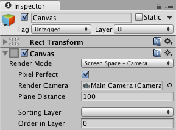

#Project 1 - Score and UI Elements 

In order for these interacting sprites to feel like a game, we need to keep track of the score, we need to display notification for winning and losing, and and we need a button that will let us start and restart the game.  

These UI / display elements will all be controlled by the GameController class, but in this section, we'll discuss how to create and position UI elements in a scene.

###Canvas
All UI elements are children of the Canvas class.  When the first UI element is added to a scene, in addition, a Canvas gameObject and an EventSystem gameObject are also added to a scene, these are required to be in the Hierarchy for every scene that has UI elements to be displayed and have interactivity.  

###Canvas: ScreenSpace-Overlay
When the Canvas is added to a scene, by default, it's layout is offset from the main camera.  For our purposes, it is easiest to configure the Canvas Component so that it's rendered in the same position as the regular game scene.  To do that, we need to change the Render-Mode of the Canvas, we'll change it from Screen-Space Overlay to Screen-Space Camera, and we'll select the `Main Camera` as the Render Camera for the canvas.    

###UI-Button:
Add a UI Button to the game scene.  Name the button 'StartButton'.  Set the text of the button to 'Start Game'.  Move the button to the center of the scene.  Set the 'normal' and 'highlight' colors of the button, so that you'll be able to see the button's highlight state when moused-over. 

###UI-Panel and Text for Score
Add a UI-Panel to the scene, name it: 'ScorePanel'.  Add a Text gameObject as a child of the 'ScorePanel', name this 'ScoreText'.  For the 'ScorePanel', set the anchors to that it's anchored to the upper right corner of the scene.  Configure the 'ScoreText', text element, so it is stretched to fit the 'ScorePanel', and set the starting text value to show 'Score: 0', with BestFit and alignment center, center as shown in the image below. Select a color for the panel and text so they will be visible during gameplay.

###UI-Panel and Text for GameOver Notification.
Create a UI-Panel and child Text element for the display of the GameOver notification.  Name the panel:  'GameOverPanel' and the text: 'GameOverText'.  Configure the text so it's stretched to fit the Panel and resize the panel and move to the center of the scene.  Set the color of the panel and text so they are visible during gameplay.  

