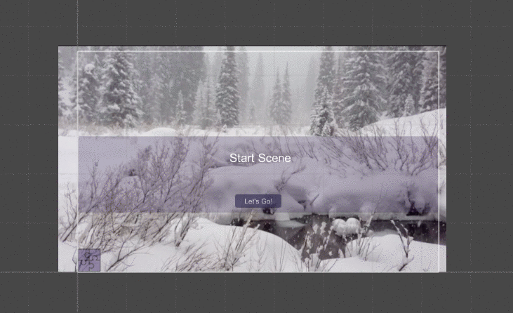

# Project 2

Here's the link to the updated starter code.

I have created examples of most features you'll want to include in your project.  I've added a few more features that we'll discuss in class.  

[Updated Starter Code (Oct 22): Unity Project Zip File](https://utdallas.box.com/s/8txw4flobwetq4fe4zb92itnp2figpce)

The image below shows the behavior of the starter project.  This includes buttons to hide panels, buttons to show panels, 
buttons to change scenes.  Also, there's some player data that gets updated each time you change scenes and this is displayed when clicking on the image button in the lower left. When clicked, this panel's visibility is toggled on and off.

