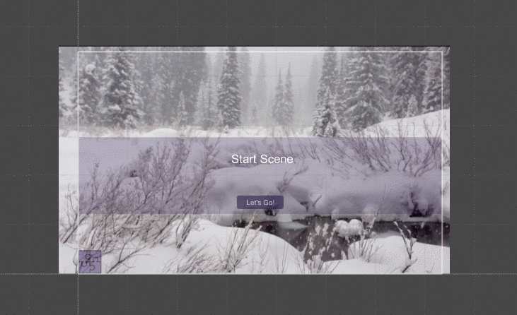
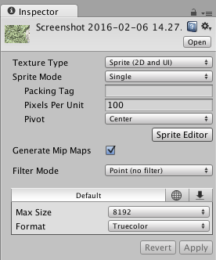
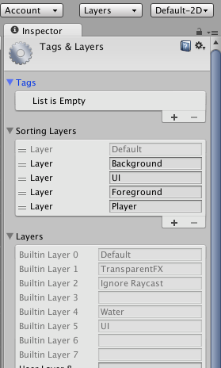
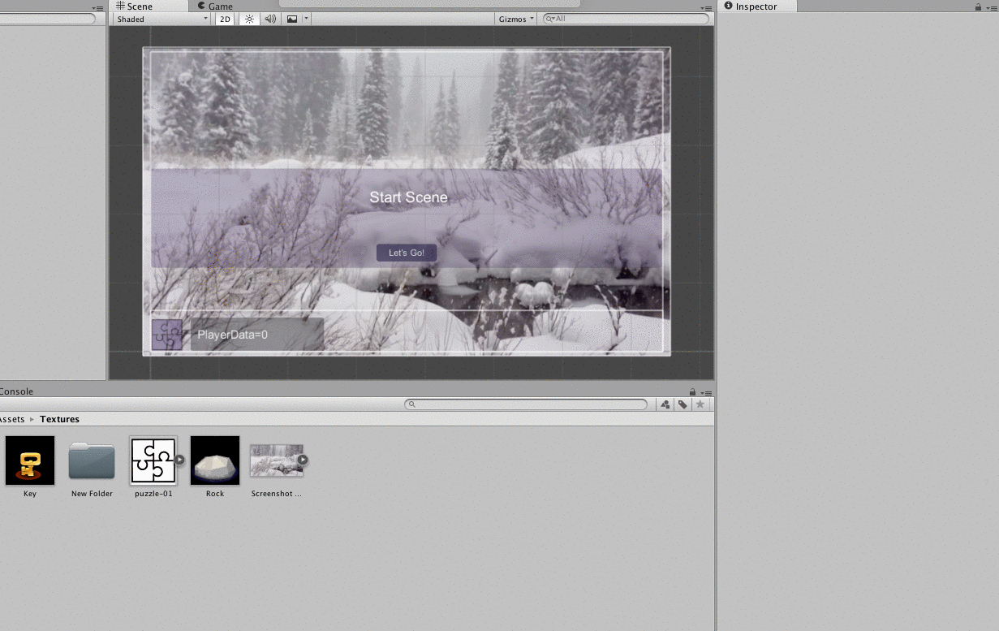

# Project 2 - Source Code
 
 See [StateManager](statemanager.md) for more details about the starter code

Here's the link to the updated starter project.
[Starter_Code_Feb16_2016](https://utdallas.box.com/Project2StarterCodeFeb16)

The image below shows the behavior of the starter project.  This includes buttons to hide panels, buttons to show panels, and buttons to change scenes.  Also, there's some player data that gets updated each time you change scenes and this is displayed when clicking on the image button in the lower left. When clicked, this panel's visibility is toggled on and off.

 
 
 
 ###2D Image: Texture to Sprite
 
 In this project you'll add images for background images and button images.  To use images in 2D mode in Unity, first create a Textures folder and then drag your images into that folder.  To use an image, select the image in the Textures folder, then in the inspector select: Texture Type = Sprite ( 2D and UI) and then 'apply'.  You may also want to set these values: FilterMode: Point, Format: Truecolor.  Now you can use this for any 2D sprite in your project, or you can use the image as a UI-Image.  
 
 
 
 ###Sorting Layers
 If we have a scene that contains images that are not UI-Images, then our canvas may be obscured by this 2D-Sprite. While the order of objects in the hierarchy should determine the layer ordering, where objects higher in the hierarchy are considered as bottom layers, and objects lower in the hierarchy are considered as nearer to the camera, this does not always work when using Sprite gameObjects in conjunction with the UI-Canvas elements.  To control ordering of these layers, we need to define _ Sorting-Layers_ and we need to assign each of our GameObjects to a sorting-layer.  To create Sorting Layers, we need to select the Layer tab above the inspector, and select _edit_.  Once the layer panel opens, we need to expand the Sorting layers and create named layers.  The ordering of sorting layers is that the top items are at the back of the rendered scene, while items at the bottom of the list are rendered as the top layer.  
 
 
 
 
 
 ###Sprite to Button Image
 
 Once you've converted your image from a Texture to a Sprite, then you can use it as a sprite for such things as a UI button.  First you'll create a UI-Button Oject, then you'll select the image-file as the source image for your button.  See animation below.  You may want to clear the text from the Button's Text field.

 Some Free - Public Domain 2-D Game Assets: 
 
 [Daniel Cook's Planet Cute](http://www.lostgarden.com/2007/05/dancs-miraculously-flexible-game.html)
 
 [Glitch Garden](http://www.glitchthegame.com/public-domain-game-art/)
 
 [Free Fantasy Maps](http://freefantasymaps.org/free-fantasy-maps/)
 
 [Open Game Art](http://opengameart.org/)
 
[ Open Game Art Bundle](http://open.commonly.cc/)

[WidgetWorx - SpriteLib](http://www.widgetworx.com/spritelib/)
 
 Also: Search the Unity Asset Store for: Unity 2D-Platformer Tutorial Assets