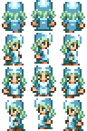

# References

1. Crawford, Chris (2012-12-12). Chris Crawford on Interactive Storytelling (2nd Edition) (p. 161). Pearson Education. Kindle Edition.
2. Shiffman, Daniel.  Learning Processing, [LeanringProcessing.org ](learningprocessing.org)
3. [Miles, Rob. C# Programming Yellow Book ](http://www.robmiles.com/c-yellow-book/) Exellent C# Book, Free online / download pdf-version.
4. Norton, Terry. [Learning C# by Developing Games with Unity 3D Beginner's Guide, Terry Norton](http://www.amazon.com/Learning-Developing-Games-Unity-Beginners-ebook/dp/B00FFUL9LY).  PacktPub eBook Version

 ###Public Domain 2-D Game Assets: 
 
 [Daniel Cook's Planet Cute](http://www.lostgarden.com/2007/05/dancs-miraculously-flexible-game.html)
 
 [Glitch Garden](http://www.glitchthegame.com/public-domain-game-art/)
 
 [Free Fantasy Maps](http://freefantasymaps.org/free-fantasy-maps/)
 
 [Open Game Art](http://opengameart.org/)
 
 [Open Game Art Bundle](http://open.commonly.cc/)

 [WidgetWorx - SpriteLib](http://www.widgetworx.com/spritelib/)
 
[Random Game-World Generator](http://donjon.bin.sh/)

[Fantasy Map Tutorial and Resources](http://calthyechild.deviantart.com/art/Fantasy-Map-TutorialxResources-258559867)

[GameArt 2D](http://www.gameart2d.com/freebies.html)

[Jessee Freeman](http://jessefreeman.com/game-art-packs/)

[Windows Platformer Game Starter Kit](http://platformstarterkit.azurewebsites.net/)
 
Also: Search the Unity Asset Store for: Unity 2D-Platformer Tutorial Assets
 
In Class -Zombie Game Items:

From: http://opengameart.org/users/osmic

http://www.villeseppanen.com

My game art portfolio. 2D, 3D and UI graphics.
Art by Osmic

[Zombie Textures Download Link](https://utdallas.box.com/zombieTextures) 

Player Sprite Sheeet: Link to download and Tutorial: https://www.youtube.com/watch?v=TU6wflRqT5Q

