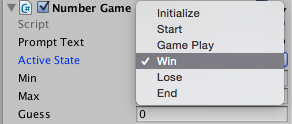

# State Controlled Number Game

###Game States:
In the previous section, we created our first version of our number game, however, we ran into some problems when we tried to use the same keyboard input value, like 'enter' for 2 different sections of the game logic. In order to eliminate this problem, we will introduce a set of discrete game States.  We will use game states to add a higher level of structure to our project.  Execution of our program will be controlled by a discrete or finite set of states, where our game can only be in one state at any one time. 

We will structure the logic of our code using these game states; for each section of our game's execution code, before any code can be executed, the game state must be checked, and the only code that can be executed is code that is associated with the game's current active state.  We'll use a finite state machine (FSM) to model our game's event logic, we'll use C# enums to define our states, then we will use [switch-case](https://kdoore.gitbooks.io/cs-2335/content/switch-case.html#switchcase) statements to structure our code to implement our state-based system.

###Finite State Machine

The diagram below is a Finite State Machine (FSM). An FSM is a mathematical or computational model of a dynamic system or process where the state of the system can be described as being in only one discrete state, out of a possible fixed set of states, at any one time. 
A FSM diagram, as shown below, consists of a set of circles, or nodes, which correspond to the allowable states of the system.  The arrows, or arcs,  correspond to events that cause the system to transform to be in a different state.  When implementing An FSM we need to have a variable that can keep track of the current active state, and we need a well defined set of states, along with the transition rules that specify which events can occur in each state and what is the next state of the system if that event occurs.  The diagram below is an FSM diagram, it contains this specification of information: states, events, state-event-state transitions.  We can also use a table to represent the same information.   The initialize and end states have a special double-circle symbol indicating that they are special states: we start in the initialize state, once in the end state, there are no events that can transition the system into any other states.  We can use the FSM to design the code implementation for our state-controlled game.


###Flow-Chart Logic and Finite State Machine - Overlay
The diagrams below show how we can integrate the Finite State Machine (FSM) structure with our Flow-Chart logic.  The FSM provides a higher-layer of structural abstraction to our logic.  We can see that each time we have an input diamond in our flow-chart, we're checking to see if specific events have happened, these input events are seen as arcs / arrows between states in the FSM. 

From the Initialize state, we're checking to see if the user inputs either a Y or an N, we can ignore all other input, because when the system is in the Initialize state, those are the only events that can cause the system to transition to a different state: 

If activeState is Initialize, Event Y causes transition so activeState becomes Start

If activeState is Initialize, Event N causes transition so activeState becomes End


###Finite State Machine:
The diagram below shows the FSM, with states colored to match the FSM and Flow-chart logic.  This may clarify the relationship between the 2 diagrams and how this impacts our code structure.
 


###Enumeration: GameStates

In C#, we can use Enumeration-Types to create custom data-types which function as named constants. We use the C# keyword `enum` to declare our custom data-type, then we must initialize the values using a comma separated list of values. We'll define an enum to provide a set of gameStates to control our game's execution logic. We can declare the enum outside any class code, it should be `public`, then it will be accessible in any code files in our project. If we make the activeState publicly accessible, then the enum values show up as a drop-down list, as shown in the image below. In addition, we can see the activeState value change while our game is executing.

```C#
public enum GameState { Initialize, Start, GamePlay, Win, Lose, End}
public gameStates activeState; //create a variable using our custom Enumeration-type
//initialize in Start()
activeState = GameState.Initialize; //dot notation allows access of enum values
```



###NumberGame.cs 

Here is the code for the State-controlled version of the NumberGame project. 

It is important to realize that in the if-statement blocks, where we are checking to see if any valid input keys have been entered, these if-statement blocks are executed only for 1-brief instant of time, so we should not put code in these statement blocks that we expect to see displayed on the screen. We use these statement blocks to change the activeState, not to display any text since the keypress event is an instantaneous trigger.  
 

```C#
using UnityEngine;
using UnityEngine.UI;  //added for UI gameObjects and UI components
using System.Collections;

//globally accessable enum which is a custom data-type
public enum GameState { Initialize, Start, GamePlay, Win, Lose, End}

public class NumberGame1 : MonoBehaviour {

	public Text gameText;   //for controlling UI-Text GameObject, Text Component

	public GameState activeState;  //create a variable of GameState-type
	public int min, max, guess; 

	// Use this for initialization
	void Start () {
		min = 0;
		max = 64;
		guess = (min + max) / 2;
		activeState = GameState.Initialize;
		Debug.Log("Do you want to play a Game, if so enter Y, else enter N");
		gameText.text = "Play?";  //test to see if UI-text is working
	}
	
	// Update is called once per frame
	void Update () {

		if (activeState == GameState.Initialize) {
			
			if (Input.GetKeyDown (KeyCode.Y)) {
				Debug.Log ("Think of a number between " + min + " and " + max + " press Enter when ready");
				activeState = GameState.Start;
			} 
			if (Input.GetKeyDown (KeyCode.N)) {
				Debug.Log ("No game today");
				activeState = GameState.End;
			}

		}

		else if (activeState == GameState.Start) {
			
			if (Input.GetKeyDown (KeyCode.Return)) {
				Debug.Log ("Is your number " + guess + " If it matches, press Return");
				Debug.Log ("Is your number higher, the press up arrow");
				Debug.Log ("Is your number lower, the press down arrow");
                activeState = GameState.GamePlay;
			}
		}

		else if (activeState == GameState.GamePlay) {  
			
			if (Input.GetKeyDown (KeyCode.UpArrow)) {
				min = guess;
				NextGuess ();  //inside self loop
			}
			if (Input.GetKeyDown (KeyCode.DownArrow)) {
				max = guess;
				NextGuess ();  //inside self loop
			}
			if (Input.GetKeyDown (KeyCode.Return)) {      //correct value
				Debug.Log ("The computer wins");
                activeState = GameState.Win;
			
			}
		}
		 //we need to win and lose and end state logic 
		 //and we need logic to restart the game and reinitialize values
		 
	}  //end Update

    //this method calculates the next guess and prompts the user to input keys to indicate match, lower, higher  
	void NextGuess(){ 
		guess = (min + max) / 2;
		Debug.Log("Is your number " + guess + " If it matches, press Enter");
		Debug.Log("Is your number higher, the press up arrow" );
		Debug.Log("Is your number lower, the press down arrow" );
	}


}  // end of class


```

###Switch-Case Statement - For FSM Structure

In our code above, at the outer-layer of logic that corresponds to the FSM structure, we are always checking the value of one variable: `activeState`.  Since we have used enums to define allowable values for our GameStates, then we'll use the enums as the case-labels that we are testing for a match against the switch-condition: `activeState`.  The code below shows how we would implement the code for the first 2 possible game-states: Initialize and Start.  The example code also shows that we'll want to include a default: case so that we can get Debug output if that code executes.

###Switch-Case
The Switch-Case control structure works well for implementing Finite State Machine logic because the logic is always testing 1 value: activeState, depending on the current value, which will match one of the cases, then the matching case statements are executed.  

See specific details on the [C# Switch-Case Statement on MSDN.
](https://msdn.microsoft.com/en-us/library/06tc147t.aspx "Switch-Case")


```C#
	void Update () {
		switch (activeState) {
		case GameState.Initialize: 
			if (Input.GetKeyDown (KeyCode.Y)) {
				Debug.Log ("Think of a number between " + min + " and " + max + " press Enter when ready");
				activeState = GameState.Start;
			} 
			if (Input.GetKeyDown (KeyCode.N)) {
				Debug.Log ("No game today");
				activeState = GameState.End;
			}
			break;

		case GameState.Start: 
			if (Input.GetKeyDown (KeyCode.Return)) {
				Debug.Log ("Is your number " + guess + " If it matches, press Return");
				Debug.Log ("Is your number higher, then press up arrow");
				Debug.Log ("Is your number lower, then press down arrow");
				activeState = GameState.GamePlay;
			}
			break;

		case GameState.GamePlay:
			if (Input.GetKeyDown (KeyCode.UpArrow)) {
				min = guess;
				NextGuess ();  //inside self loop
			}
			if (Input.GetKeyDown (KeyCode.DownArrow)) {
				max = guess;
				NextGuess ();  //inside self loop
			}
			if (Input.GetKeyDown (KeyCode.Return)) {      //correct value
				Debug.Log ("The computer wins");
				activeState = GameState.Win;
			}
			break;

		default:
			Debug.Log ("No match on activeState");
			break;
		}//end of switch statement

		//need win and lose state logic and need logic to restart the game and reinitialize values
	
	}  //end Update

```