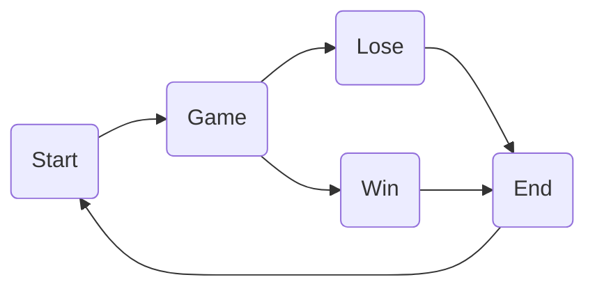

#State-Controlled UI GameObjects

For the Number game, we want to create a graphical version of the game where the prompts are displayed on the game screen.  We will work in 2D mode, and we need to use a UI game object to  

