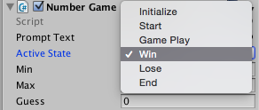

#State-Controlled UI GameObjects

For the Number game, we want to create a graphical version of the game where the prompts are displayed on the game screen.  We will work in 2D mode, and we need to use a UI game object to display  the text.  This will involve a few steps in order to allow our game script file to modify the UI-Text elements during the game. We'll create a simple example of UI-Text script called StateController.cs, once we understand how to create UI-Text and control it with code for this simplified example, we can integrate these changes into the NumberGame.cs C# script.  [See Screenshot Animation 1 Below](https://kdoore.gitbooks.io/cs-2335/content/state_controlled_ui-text.html#animations)

-  GameObject -> Add a UI -> Text gameObject to the scene
    -  This creates a Canvas gameObject in the Hierarchy Panel
    -  This creates an EventSystem in the Hierarchy Panel
    -  Double-click the text element to find it within the scene.
    - Give it a unique name in the inspector
    -  Set the color, position, fontSize of the Text in the inspector, make sure to scale the text area so the text is visible on the screen
    -  Set the initial text value of the text component in the inspector
    -  In NumberGame.cs, add a library reference: using UnityEngine.UI at the top of your code
    -  Write code in the NumberGame.cs file to declare a public Text variable, initialize and modify in the script file.
    -  Connect script-component public text-variable and UI-text elements in the inspector on the gameObject that has the numberGame.cs script component attached.

###Canvas and Event System 
When we add a UI Text element to our scene, it also creates a *Canvas GameObject* and an *EventSystem GameObject* in the scene.  We won't use the EventSystem object in this phase of the project, but it's important to realize this is required for any user-interaction with UI elements, when copying UI elements between scenes, always make sure the new scene has an EventSystem GameObject in the Hierarchy - this is a difficult error to debug.  The Canvas object is the container for any UI-Text objects in our scene, and our Text object's transform object is defined relative to the canvas since the Text is a child of Canvas in the Hierarchy panel. Adding additional UI elements to the scene does cause additional Canvas or EventSystem gameObjects to be added to the scene. 

For this project, let's attach the NumberGame.cs script file to the canvas object (instead of the text or main camera game objects) since we'll be controlling several Text-UI objects which are all contained in the canvas game object from the script, this isn't necessary but it is logical that we'll want to attach scripts to objects we're controlling.

###Code for UI-Text Integration

In our NumberGame.cs script, we need to add a new UnityEngine code library so that we can access the UI library functions. We also need to create a script Text variable for each UI-Text GameObject that will be linked to the UI Text in the game scene so that it can modify the properties of the UI-Text GameObject. We need to make sure our Text variables are declared as public instance variables so that they will show up in the script-component section of the inspector panel for the object that we've attached our script to.  

````java
using UnityEngine;
using UnityEngine.UI;  //make sure to add Unity UI library
using System.Collections;


public class NumberGame : MonoBehaviour {
	public Text gameText;  //game dialog
	public Text numberText;  //guessed number
	public Text instructionText;  //input instructions
	
	}
	
````

Next, go back into Unity, select the Canvas object in the Hierarchy Panel, (make sure we've attached our script to the Canvas GameObject), then we need to connect our TextUI elements with the public instance variables from our script component. We can do this by either dragging the UI-Text object from the hierarchy panel to the script component text-box, or we can select the text element in the script component, select the dot to the right of the text field and it will open a pop-up of all possible game-objects that we can select to connect to this script variable element.   [See Screenshot Animation 2 Below](https://kdoore.gitbooks.io/cs-2335/content/state_controlled_ui-text.html#animations)


###Connecting C# Text elements to Unity UI-Text.
In the NumberGame.cs file, we need to write code to modify the UI text elements.  We've declared the public Text elements as class instance variables.  Now in the code we want to modify the Text.

We can initialize the text elements in Start()
```
void Start(){
    gameText.text="Want to play a game? Y or N \n" ;
````
###Enumeration: GameStates

In C#, we can use Enumeration-Types to create custom data-types which function as named constants.  We use the C# keyword enum to declare our custom data-type, then we must initialize the values using a comma separated list of values.  We'll define an enum to provide a set of gameStates to control our game's execution logic.  We can declare the enum outside any class code, it should be public, then it will be accessible in any code files in our project. If we make the activeState publicly accessible, then the enum values show up as a drop-down list, as shown in the image below. In addition, we can see the activeState value change while our game is executing.

```java
    public enum GameState { Initialize, Start, GamePlay, Win, Lose, End}
	public gameStates activeState;  //create a variable using our custom Enumeration-type
	
	//initialize in Start() 
	activeState = GameState.Initialize;  //dot notation allows access of enum values
```


###NumberGame.cs 

Here is the code for the State-controlled version of the NumberGame project. 

It is important to realize that in the if-statement blocks, where we are checking to see if any valid input keys have been entered, these if-statement blocks are executed only for 1-brief instant of time, so we should not put code in these statement blocks that we expect to see displayed on the screen. We use these statement blocks to change the activeState, not to display any text since the keypress event is an instantaneous trigger.  
 

```
using UnityEngine;
using UnityEngine.UI;  //added for UI gameObjects and UI components
using System.Collections;

//globally accessable enum which is a custom data-type
public enum GameState { Initialize, Start, GamePlay, Win, Lose, End}

public class NumberGame1 : MonoBehaviour {

	public Text promptText;   //for controlling UI-Text GameObject, Text Component

	public GameState activeState;  //create a variable of GameState-type
	public int min, max, guess; 

	// Use this for initialization
	void Start () {
		min = 0;
		max = 64;
		guess = (min + max) / 2;
		activeState = GameState.Initialize;
		Debug.Log("Do you want to play a Game, if so enter Y, else enter N");
		promptText.text = "Play?";  //test to see if UI-text is working
	}
	
	// Update is called once per frame
	void Update () {

		if (activeState == GameState.Initialize) {
			
			if (Input.GetKeyDown (KeyCode.Y)) {
				Debug.Log ("Think of a number between " + min + " and " + max + " press Enter when ready");

				Debug.Log ("Changing: ActiveState " + activeState);
				activeState = GameState.Start;
				Debug.Log ("Changed:  ActiveState " + activeState);
			} 
			if (Input.GetKeyDown (KeyCode.N)) {
				Debug.Log ("No game today");

				Debug.Log ("Changing: ActiveState " + activeState);
				activeState = GameState.End;
				Debug.Log ("Changed:  ActiveState " + activeState);
			}

		}

		else if (activeState == GameState.Start) {
			
			if (Input.GetKeyDown (KeyCode.Return)) {
				Debug.Log ("Is your number " + guess + " If it matches, press Return");
				Debug.Log ("Is your number higher, the press up arrow");
				Debug.Log ("Is your number lower, the press down arrow");

				Debug.Log ("Changing: ActiveState " + activeState);
				activeState = GameState.GamePlay;
				Debug.Log ("Changed:  ActiveState " + activeState);
			}
		}

		else if (activeState == GameState.GamePlay) {
			
			if (Input.GetKeyDown (KeyCode.UpArrow)) {
				min = guess;
				Debug.Log ("NoChange: ActiveState " + activeState);
				NextGuess ();  //inside self loop
			}
			if (Input.GetKeyDown (KeyCode.DownArrow)) {
				max = guess;
				Debug.Log ("NoChange: ActiveState " + activeState);
				NextGuess ();  //inside self loop
			}
			if (Input.GetKeyDown (KeyCode.Return)) {  //correct value
				Debug.Log ("The computer wins");

				Debug.Log ("Changing: ActiveState " + activeState);
				activeState = GameState.Win;
				Debug.Log ("Changed:  ActiveState " + activeState);
			}
		}
		 //need win and lose state logic and need logic to restart the game and reinitialize values
		 
	}  //end Update

	void NextGuess(){
		guess = (min + max) / 2;
		Debug.Log("Is your number " + guess + " If it matches, press Enter");
		Debug.Log("Is your number higher, the press up arrow" );
		Debug.Log("Is your number lower, the press down arrow" );
	}


}  // end of class


```

### Animations 
1. How to Create Text-UI Game Objects and Attach Script to Canvas Object
2. How to Connect Text-UI Game Object to Script Text Element


In the animation below, we have 2 UI-Text GameObjects: StateText and GameText. We want to link them with 2 class instance-variables, stateText and instructText, that are contained in a C# class file: StateController.cs.  This script component for this C# class is attached to the Canvas GameObject, so we first need to select the Canvas object in the Hierarchy, then we find the variables in script-component in the inspector.  Then we can either drag the UI-Text GameObjects, or we can select the tiny circle tool immediatly to the right of the text variable name which will open a new panel with all GameObjects that match the same type in our scene.


###Questions
1.  How can we add a counter to limit the number of computer attempts so that the player can also win the game?
