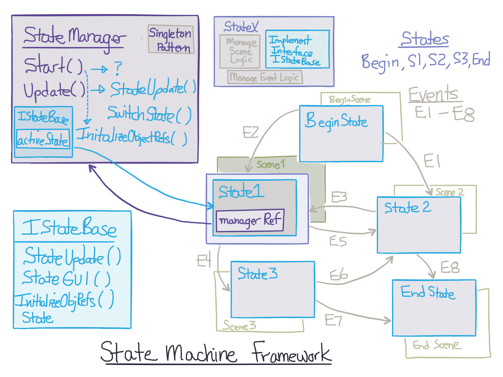
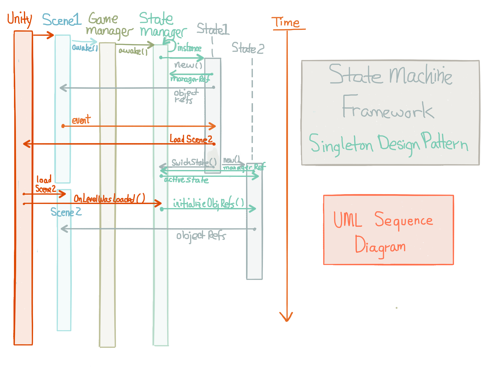

# State Machine Framework

The diagram below gives an overview of how we will implement a State Machine Framework for a Unity project. 

###StateManager Class
The StateManager class will manage the stateMachine. It will keep track of the current activeState, it will delegate responsibility for scene logic to the current activeState. It will manage and coordinate messaging and state-transition event synchronization.

###Persistent Object: InstanceRef
The StateManager class will use the Singleton Design Pattern which will insure that only 1 instance: `instanceRef` of this class will exist in our program.  The StateManager class will inherit from MonoBehaviour, this means we can attach this script to an empty GameObject in the starting scene for our program. We'll use the Unity function: `DontDestroyOnLoad(gameObject)` to insure this script component is not destroyed when transitioning between scenes.  

###Keep Track of the ActiveState
We will use the StateManager object to keep track of the current `activeState`.  Finite State Machines require that we maintain a persistent reference to the currently activeState, so this is one responsibility of our StateManager class.

###Delegate Control to the ActiveState
We will use the StateManager instance to delegate control of the Scene's logic to the current activeState object instance.  To delegate control, we need to provide the current activeState instance with the ability to have code executed when the Unity Event Functions execute, this will insure the logic code gets executed when necessary.  For each Unity event function that is useful for the activeState to execute, we'll need to provide the activeState a similar event hook, and this will be executed in the StateManager Unity Event Function as discussed using the Unity Update () Event.

###Unity Update( ) Event
Since StateManager inherits from MonoBehaviour, we can implement the Update() function.  In that function we want to call a function for the activeState which will provide the same functionality:

````
///inside StateManager.cs

void Update( ){
    activeState.StateUpdate( );  
}

////inside BeginState.cs

void StateUpdate(){
    doSomethingEveryFrame();
}

```

##State Machine Framework - Overview Diagram


###StateManager.cs Code
```
   public class StateManager : MonoBehaviour {

	public static StateManager instanceRef;
	private IStateBase activeState; //interface as object reference for classes that implement the interface

	public GameScene curScene;

	//add comments
	void Awake(){
		if (instanceRef == null) {
			instanceRef = this;
			DontDestroyOnLoad (gameObject);  //the gameObject this is attached to 
		} else {   //
			DestroyImmediate(gameObject);   
			Debug.Log ("Destroy GameObject");
		}

	}
	// Use this for initialization
	void Start () {
		activeState = new BeginState (this);
		curScene = GameState.Begin;
		activeState.InitializeObjectRefs ();
	}

	// Update is called once per frame
    //removed from starter code - Fall_16
	void Update () {
		if (activeState != null) {
			activeState.StateUpdate ();
		}
	}

	//add comments
	public void SwitchState(IStateBase newState){
		activeState = newState;
		curScene = newState.Scene;
		Debug.Log ("Add Debug Info");
	}


	//add comments
	void OnLevelWasLoaded(int levelNum) {
		if (levelNum == (int)curScene) {
			Debug.Log ("Add Debug Info");
			activeState.InitializeObjectRefs ();
		}
        else{
        //Give some good debug info here 
        //If this is executed, it's because there's a problem with State - Scene matchup
        Debug.Log("Big Trouble");
        }
	}
}

```
##State Machine Framework With Scenes




###State Machine Framework UML Sequence Diagram
The sequence diagram below shows the asynchronous nature of the relationship between Unity Scenes and our custom states,  The StateManager provides a conduit for synchronization communication of event messages between Unity Scenes and our custom states.  
The StateManager receives notification from the Unity engine when a new scene has been loaded, it uses this event ``OnLevelWasLoaded(int levelNumber)`` to send the activeState message, by exectuing the ``activeState.InitializeObjectRefs( )``, so the current activeState can now initialize all object references to gameObjects in the corresponding scene.



