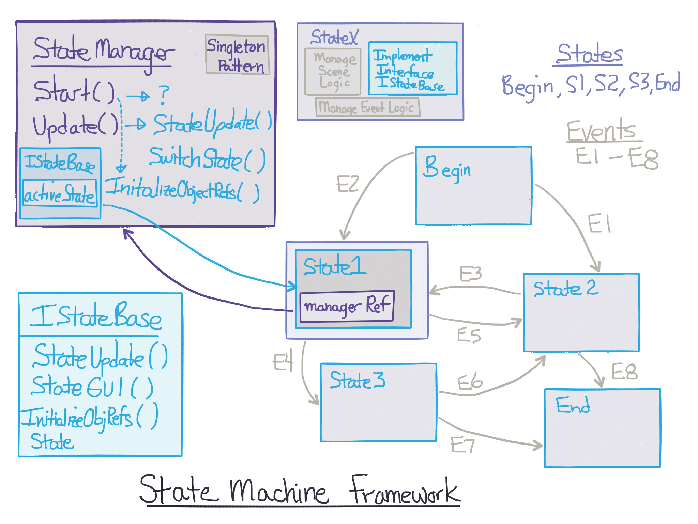

# State Machine Framework

The diagram below gives an overview of how we will implement a State Machine Framework for a Unity project. 

We will create the StateManager class to manage the stateMachine.  

###Persistent Object: InstanceRef
We'll use the Singleton Design Pattern which will insure that only 1 instance: `instanceRef` of this class will exist in our program.  We'll attach this script to an empty GameObject in the starting scene for our program, and we'll use the Unity function: `DontDestroyOnLoad(gameObject)` to insure this script component is not destroyed when transitioning between scenes.  

###Keep Track of the ActiveState
We will use the StateManager object to keep track of the current `activeState`.  Finite State Machines require that we maintain a persistent reference to the currently activeState, so this is one responsibility of our StateManager class.

