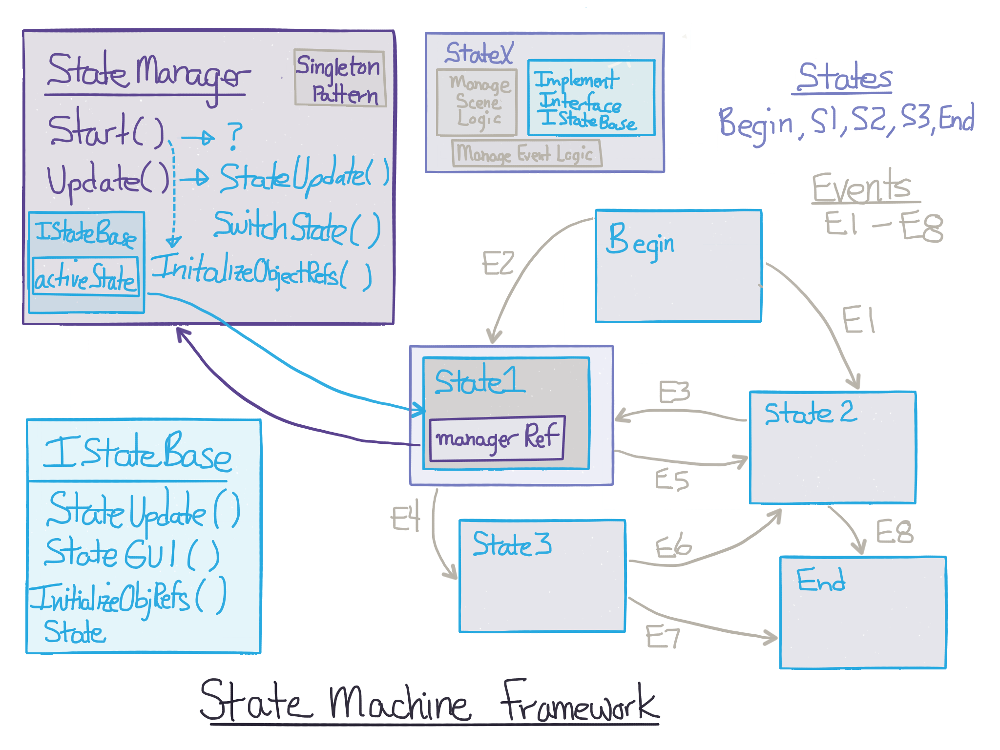

# State Machine Framework

State Machines provide a framework to manage the logic of an event-driven dynamic system.  Many aspects of game-design/development can be modeled and implemented by state-machines.  For   visual novels, we can consider each Scene as a game-state, where player decisions are the events that allow change between scenes.  

 We implement the StateManager class to manage the State Machine structure.  
 
 State-Machines structure: 
 -  a finite set of states, 
 -  a well-defined set of events that correspond to transitions between states 
 - tracking the currently active state

