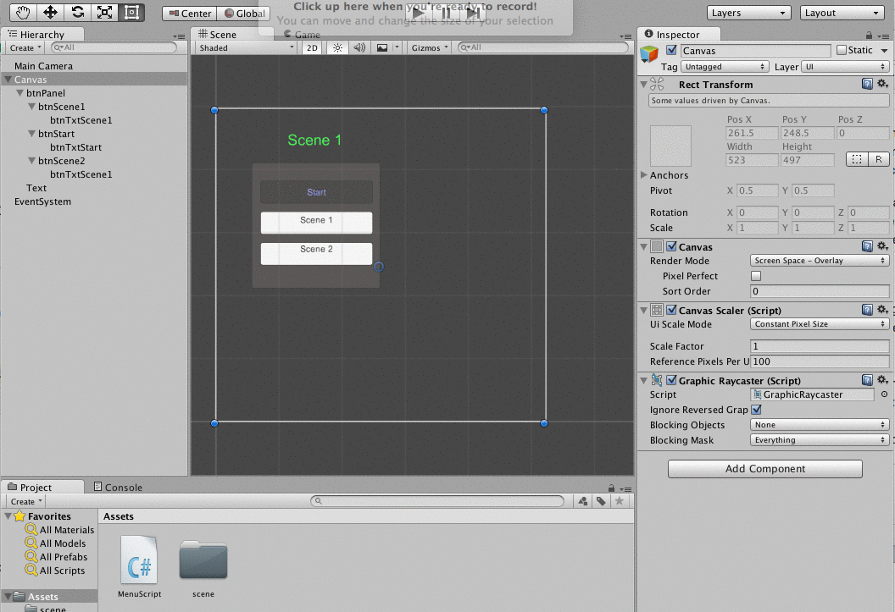

#UI Buttons for Level Control

In Unity, we can use Scenes to implement game levels, we can write C# scripts to write a versatile controller method that can be used on any button to change the game scene.  

We will create a new Unity 2D project and create 3 different scenes: Start, Scene1, End.  Then we also need to create 3 buttons that will allow the user to jump between the scenes. Here are the steps we'll need to do. 

1. Add 3-Buttons to each Scene
2. Add all scenes to the edit => Build Settings 
3. Write a MenuScript to define a LoadScene(int level) custom method 
4. Attach the MenuScript to an object in the scene - we'll attach it to the Canvas since it's acting on Canvas elements
5. Attach the canvas object: menuScript to the button onClick() handler.
6. Select the LoadScene(int level) function to be executed for the onClick() method
7. Put the correct Scene index value into the parameter box for the LoadScene method: Ie: for the start button, the index value should be 0.


###MenuScript LoadScene() Method
Below is the code for our loadScene() method that will be attached to each button's onClick event handler.  

```
	public void loadScene (int level){
		Application.LoadLevel(level);
		Debug.Log ("change scene to " + level);
	}
	
```

The animation below the code shows how to implement this. First the MenuScript is added to the Canvas object, then the button's onClick() method is set by adding the Canvas object to the onClick script source.  Then the dropdown allows selection of the loadScene() method.  Finally we set the int input value so that it matches the index of the level we want loaded when the user clicks the button.  


	
The animation below the code shows how to implement this. First the MenuScript is added to the Canvas object, then the button's onClick() method is set by adding the Canvas object to the onClick script source.  Then the dropdown allows selection of the loadScene() method.  Finally we set the int input value so that it matches the index of the level we want loaded when the user clicks the button.  

###Buttons to control UI Panels.
In the image above, we also have added a UI-Panel gameObject to our canvas.  Then we used it as a container in the hierarchy to 'hold' our 3 button UI elements. We want to create a different button that can control the visibility of the UI-Panel:  btnPanel and we need to write a custom method in our MenuScript class that will toggle the panel visibility when the user clicks the button. 

The UI Panel can not be directly referenced in our C# scripts.  In order to use the panel to control visibility of it's