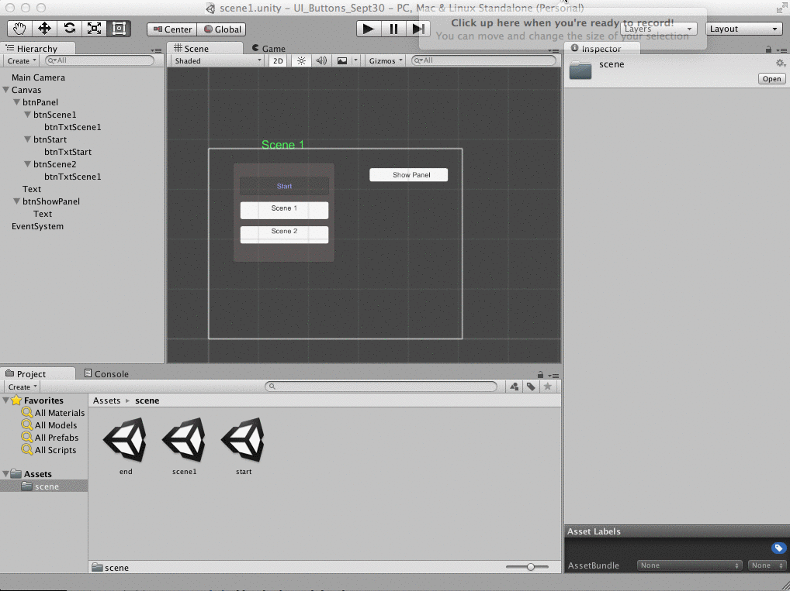

#UI Buttons To Change Scene

In Unity, we can use Scenes to implement game levels, we can write C# scripts to write a versatile controller method that can be used on any button to change the game scene.  

We will create a new Unity-2D project and create 3 different scenes: Start, Scene1, End.  Then we also need to create 3 buttons that will allow the user to jump between the scenes. Here are the steps we'll need to do. 

1. Add 3-Buttons to each Scene
2. Add all scenes to the edit => Build Settings  => Scenes
3. Write a custom Script: menuScript, to define a LoadScene(int level) custom method 
4. Attach the MenuScript to an object in the scene - we'll attach it to the Canvas since it's acting on Canvas elements
5. Attach the canvas object: menuScript to the button onClick() handler.
6. Select the LoadScene(int level) function to be executed for the onClick() method
7. Put the correct Scene index value into the parameter box for the LoadScene method: Ie: for the start button, the index value should be 0.
8. We can execute this logic completely from code, see last section for details. 

###Add Scenes to Project Build Settings




###Control UI Elements via Code
Although there are methods that allow us to use the inspector to determine which method gets executed when a Button is clicked, it is preferable to implement this logic within a custom script.  This is a better way to implement the logic because we can put all of the code for a scene's Button logic in a single custom script, this will make it easier to extend our project and to debug issues.  The code below shows how we can create an object reference to a the <Button> Component of a Button GameObject, which is where we want to attach the Method that we want executed when the button is clicked.  Here we have created a method:  LoadBeginState(), this will switch to the Scene named: "Begin".  

We must create a custom method that we want to have executed by the Button component's onClick event, we'll learn more about passing functions to the AddListener Method, but essentially, we are using the method name: LoadBeginState, as an argument to AddListener( ), this registers our LoadBeginState as a Listener to this button's onClick event.

```java

using UnityEngine;
using UnityEngine.UI;

public class MenuScript : MonoBehaviour {

	private Button BeginButton;  ///reference to Button component on a Button UI Game Object

	void Start () {
		BeginButton = GameObject.Find ("Begin").GetComponent<Button> ();  //here we cache the reference
		BeginButton.onClick.AddListener( LoadBeginState );  //Add a Listener to the Button's onClick() Event

	}

	// our custom method, this is called when "Begin" Button, Button Component onClick() executes
	public void LoadBeginState(){
		Application.LoadLevel ("Begin");  //load the Scene named "Begin"
	}
}
 

```