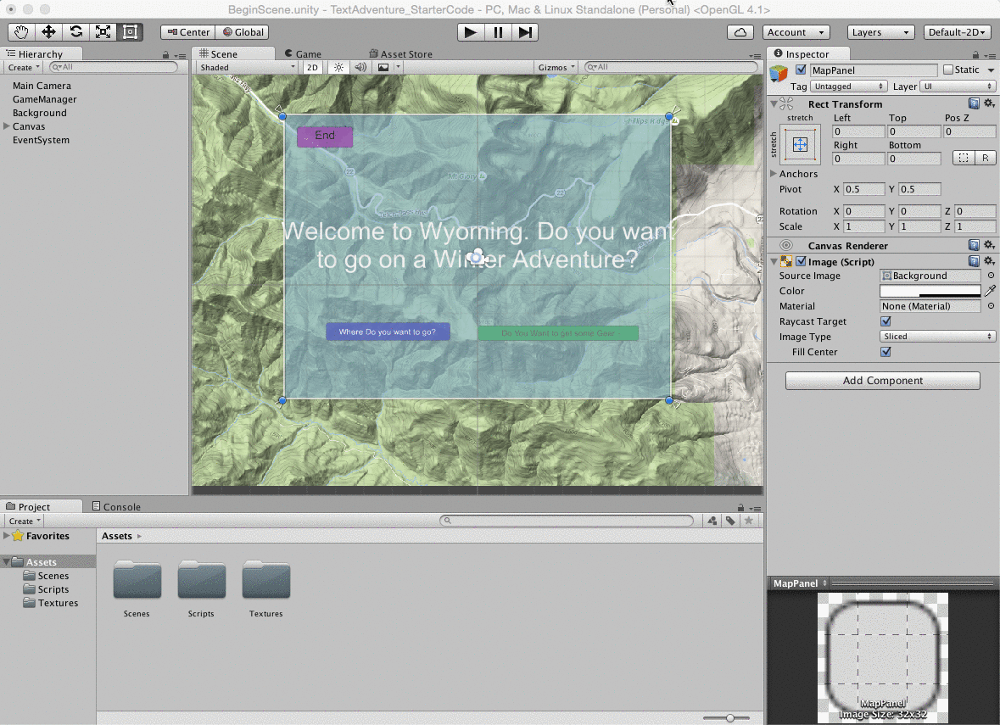

#UI-Panel: Toggle Visibility

###Learning Goals:  
- Learn how to execute custom C# script functions using UI-Button GameObjects.
- Learn how to use Layout Component: CanvasGroup attached to a UI-Panel to control visibility and interactivity of a UI-Panel and it's child GameObjects
- Public class methods of class-objects attached to a GameObject can be accessed in the inspector.  We can attach these methods to the onClick event of a Button GameObject
- private class methods can be used for controlling buttons and UI-Panel visibility
- Canvas Group attributes:  Alpha, Interactable, BlocksRaycast determine whether events can be triggered from GameObjects, these can be controlled via custom C# scripts.

###Buttons to control UI Panels.
If we add a UI-Panel gameObject to our canvas.  We can use it as a container in the hierarchy to 'hold' our other UI elements. We can create a different button to can control the visibility of the UI-Panel:  startPanel and we need to write a custom method in our Script class that will toggle the panel visibility when the user clicks the button. 

The UI Panel can not be directly modified as a component in our C# scripts.  In order to use the panel to control visibility of itself and it's child elements, we need to add a ``Component -> Layout -> CanvasGroup`` to the Panel gameObject.   Here's a link to the Unity Documentation on [CanvasGroup](http://docs.unity3d.com/Manual/class-CanvasGroup.html)



Once we have added the CanvasGroup component to our Panel-UI element, then we can need to write a function that will toggle the panel's alpha value, interactibility,and blocksRaycast properties.  We can add this functionality to any C# script file.  

###Scene Load-Event - calls Start()
We need to initialize the value of our object references within the InitializeObjectRefs() method.  This way the object references will be re-initialized each time we enter this particular Scene. 

### Toggle Properties: Alpha, Interactive and BlocksRaycast 

Below is the new code that we've added to  our class.  

```
   private Button mapBtn;
   private CanvasGroup mapCG, startCG;
	
	public void InitializeObjectRefs (){
	    ///Map Button is used to hide StartPanel and show  MapPanel
		mapBtn = GameObject.Find ("MapButton").GetComponent<Button> ();
		mapBtn.onClick.AddListener (LoadMapPanel);  //method called when mapBtn is clicked

     //CanasGroup components on Panel gameObjects
        startCG = GameObject.Find ("StartPanel").GetComponent<CanvasGroup> ();
		mapCG = GameObject.Find ("MapPanel").GetComponent<CanvasGroup> ();

    //initializes panel configuration when scene loaded
		ShowPanel (startCG);
		HidePanel (mapCG);
		
	}
	
```
	
###HidePanel, ShowPanel Methods
```
	//Modifies CanvasGroup component properties to make visible
	private void ShowCG( CanvasGroup cg){
		cg.alpha = 1;
		cg.blocksRaycasts = true;
		cg.interactable = true;
	}

    //Modifies CanvasGroup component properties to hide
	private void HideCG( CanvasGroup cg){
		cg.alpha = 0;
		cg.blocksRaycasts = false;
		cg.interactable = false;
	}
	
```

###Call HideCG() from Button onClick()
Now we need to create a button that's in the StartPanel, this button will control the visibility of the StartPanel and MapPanel.  It will call the LoadMapPanel() method when it's onClick() event is triggered.


```
  public void InitializeObjectRefs (){
     // 
    mapBtn = GameObject.Find ("MapButton").GetComponent<Button> ();
	mapBtn.onClick.AddListener (LoadMapPanel);
	}
		
		//function called when mapBtn is clicked - shows mapCG, hides startCG
    private void LoadMapPanel(){
        ShowCG(mapCG);
        HideCG(startCG);
    }

```

