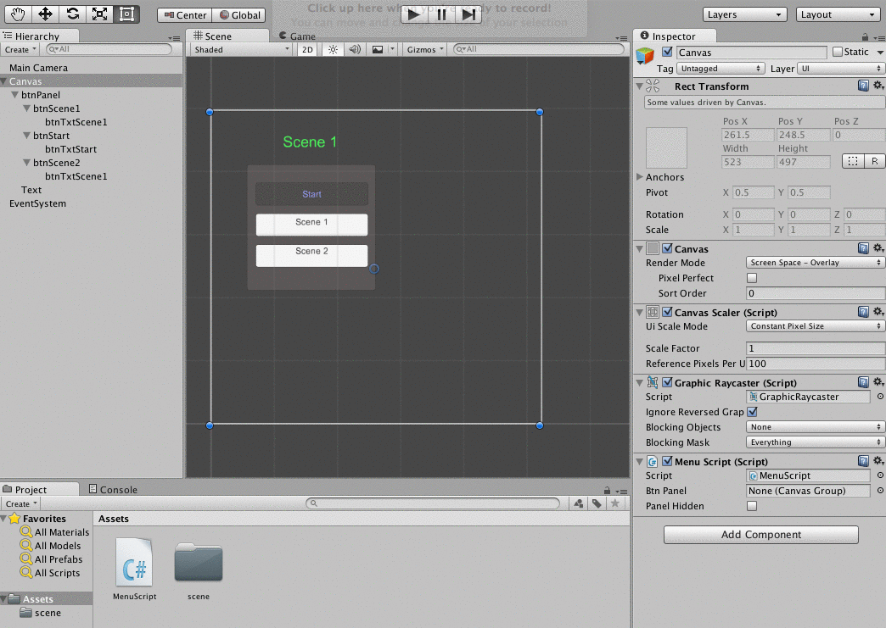
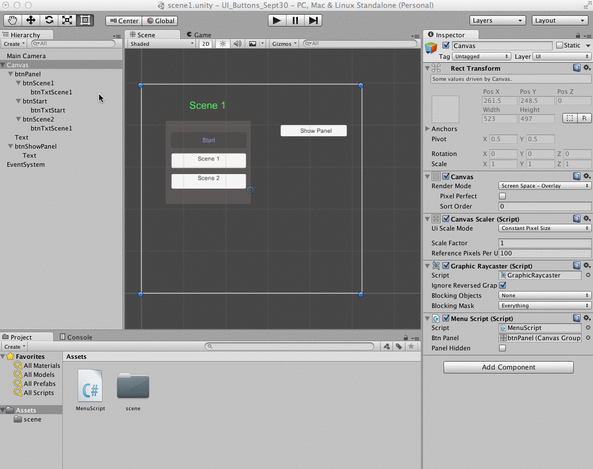

#UI-Panel: Toggle Visibility

###Learning Goals:  
- Learn how to execute custom C# script functions using UI-Button GameObjects.
- Learn how to use Layout Component: CanvasGroup attached to a UI-Panel to control visibility and interactivity of a UI-Panel and it's child GameObjects
- Public class methods of class-objects attached to a GameObject can be accessed in the inspector.  We can attach these methods to the onClick event of a Button GameObject
- Canvas Group attributes:  Alpha, Interactable, BlocksRaycast determine whether events can be triggered from GameObjects, these can be controlled via custom C# scripts.

###Buttons to control UI Panels.
In the previous section, we also have added a UI-Panel gameObject to our canvas.  Then we used it as a container in the hierarchy to 'hold' our 3 button UI elements. We want to create a different button that can control the visibility of the UI-Panel:  btnPanel and we need to write a custom method in our MenuScript class that will toggle the panel visibility when the user clicks the button. 

The UI Panel can not be directly referenced in our C# scripts.  In order to use the panel to control visibility of itself and it's child elements, we need to add some ``Component`` to the Panel gameObject.  To control the UI Panel's visibility from our custom C# class, CanvasGroup is the component we need to add.  Here's a link to the Unity Documentation on [CanvasGroup](http://docs.unity3d.com/Manual/class-CanvasGroup.html)

Once we have added the CanvasGroup component to our Panel-UI element, then we can need to write a function that will toggle the panel's alpha value.  For now, we can add this function to our MenuScript.cs file.  We need to create a bool state variable `panelHidden' that can help us remember the visibility state of our panel.  We could also just test the value of the alpha variable, but since we will probably want to be adding additional logic to our program that relies on these state variables, let's just start setting up that program-state structure.  

###Scene Load-Event - calls Start()
We need to initialize the value of our `panelHidden` variable and the alpha value within the Start() method.  This way the variables will be re-initialized each time we enter this particular Scene. When a Scene is first loaded, this is when the Start method for every active game object is executed.  

### Toggle Properties: Interactive and BlocksRaycase 

###hidePanel Method

Below is the new code that we've added to MenuScript.cs.  
```
    public CanvasGroup btnPanelCG;
	public bool panelHidden;
	
	// Use this for initialization of object references
	void Start () {
		panelHidden=true;
		btnPanelCG.alpha=0;
		btnPanelCG.interactable=false;
		btnPanelCG.blocksRaycast=false;
	}
	
	public void hidePanel(){  //toggles visiblity
		if(panelHidden==true){  // if it's currently hidden
			btnPanelCG.alpha=1;   //set visible
			btnPanelCG.interactable=true;
			btnPanelCG.blocksRaycast=true;
			  //turn on interactivity for the panel and it's children
			Debug.Log ("made visible");
			panelHidden=false;  //change the state
		}else{   // is currently visible // change to invisible 
			btnPanelCG.alpha=0;
			btnPanelCG.interactable=false;
			btnPanelCG.blocksRaycast=false;
			  //turn on interactivity for the panel and it's children
			Debug.Log ("made hidden");
			panelHidden=true;  //change the state
		}
	}
	
	```
### Connect MenuScript.btnPanel with Scene btnPanel

Now we need to establish the connection between our MenuScript public variable: btnPanel and the Unity scene where we want to implement this behavior.  Since the MenuScript script is attached to the Canvas object, that is the gameObject where we need to add this connection.  The animation below shows that we need to populate the MenuScript.btnPanel variable box with the gameObject: btnPanel in our unity scene.



###Call hidePanel() from Button onClick()
Now we need to create a button that's not in the btnPanel, this button will control the visibility of the btnPanel.  It will call the MenuScritp.hidePanel() method when it's onClick() event is triggered.



Rather than use the inspector to make connections between our code and the scene gameObjects, we can also create these connections directly in our code using 

```
Private Button sceneBtn;
sceneBtn = GameObject.Find("ButtonInScene").GetComponent<Button>();
sceneBtn.onClick.addListener(myFunction);

void myFunction(){
    //doSomething();
}

``


