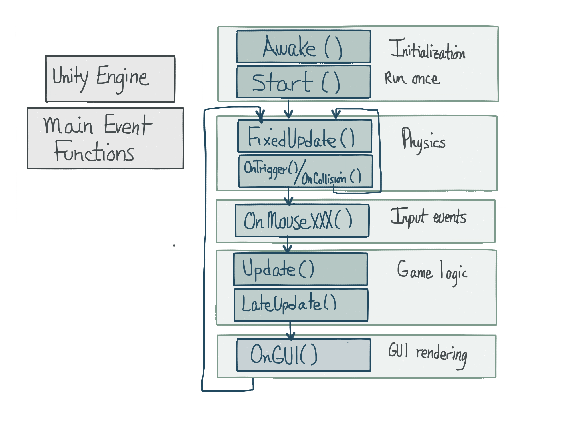

# Unity Engine - Event Functions

The Unity Engine provides a set of [Event Functions](http://docs.unity3d.com/Manual/EventFunctions.html) which can be used to create custom behavior in any custom class that inherits from MonoBehaviour.    When creating a custom script, MonoDevelop pre-populates our starter code by including basic code for Start() and Update() functions, but it's important to note that there are other event functions, such as events generated by user-events or by collisions detected by the Physics Engine that we may want to use in our scripts. 

###Exeuction Order 

The order of execution of these events is specified by the Unity Engine and illustrated in the image below.  The image below shows the main event functions that we can use in our custom scripts.  There are more event functions than those shown in the image below, but these are the most common ones use in custom scripts.The [Unity Documentation - Event Execution Order](http://docs.unity3d.com/460/Documentation/Manual/ExecutionOrder.html) provides more details about execution order and includes documentation for additional event functions.  The majority of our custom game logic will likely be contained in the Update() function which is called once per frame.  We'll use FixedUpdate() when we want to use the Unity Physics Engine to realistic movement of gameObjects. Because it is called at fixed-time intervals, it may be called more than once per frame, particularly if extensive computation being processed in each frame as this can result in delayed or irregular intervals for execution of the basic Update() function.  

