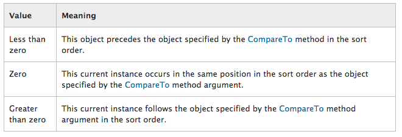

#Zombie - Sorting

What does it mean to *sort* a list of zombies?  The process of sorting means that there is a defined order of value for each element of the collection and that we can compare any 2 elements of the collection and determine which element has the higher value, are they equal valued, and which has the lower value.  So for every comparison of 2 elements of the collection, there are 3 possible outcomes.  We select one element, then compare to an *other* element, our primary element is either: Greater than, Equal to, or Less than the *other* element.  

In the code below, we implement the generic interface:  IComparable < T >, where we're specifying that the Type of object comparison we want to implement is for *Type: Zombie*.  Below implement this interface for our Zombie class, this will allow comparison of pairs of Zombie object instances. IComparable < Zombie >

###IComparable < T >

MSDN Reference [IComparable < T >](https://msdn.microsoft.com/en-us/library/4d7sx9hd.aspx)

```
Method:  CompareTo(T)   // Compares the current instance with another object of the same type and returns an integer that indicates whether the current instance precedes, follows, or occurs in the same position in the sort order as the other object.
```
[Table Below from the MSDN Reference](https://msdn.microsoft.com/en-us/library/4d7sx9hd.aspx)



CompareTo() Method Implementation for the Zombie Class: We have decided to order our zombies according to the value of the number of BrainsEaten.
```
//IComparable Method
	public int CompareTo(Zombie other){
		if(other == null){
			return 1;
		}
		return this.BrainsEaten-other.BrainsEaten;
	}
```

Having Defined the CompareTo() method and the IComparible Interface, now we can store Zombie objects in a generic List < T > and we can use the Sort() method for the List, and it will sort our Zombies according to which has the highest value for BrainsEaten.  The code below shows how we would use this new Sort functionality;

```
using UnityEngine;
using System.Collections;
using System.Collections.Generic;  //required for generic list

public class Example : MonoBehaviour {
	
	//Define our Generic List of Zombies
	public List<Zombie> zombieList;
	
	// Use this for initialization
	void Start () {
	    //initialize our list with Zombie Objects add each one to our zombieList
		zombieList=new List<Zombie>();
		zombieList.Add(new Zombie("Stubbs", Random.Range (10,15),Random.Range (5,15)));
		zombieList.Add(new Zombie("Rob", Random.Range (10,15),Random.Range (5,15)));
		zombieList.Add(new Zombie("White", Random.Range (10,15),Random.Range (5,15)));
		zombieList.Sort();    //Use the Sort() method for the List, it knows how to sort our zombies: 
		
		foreach(Zombie z in zombieList){  //List implements IEnumerable
			print("name:  " + z.Name + "  brainsEaten " + z.BrainsEaten);
		}
	}
}
```