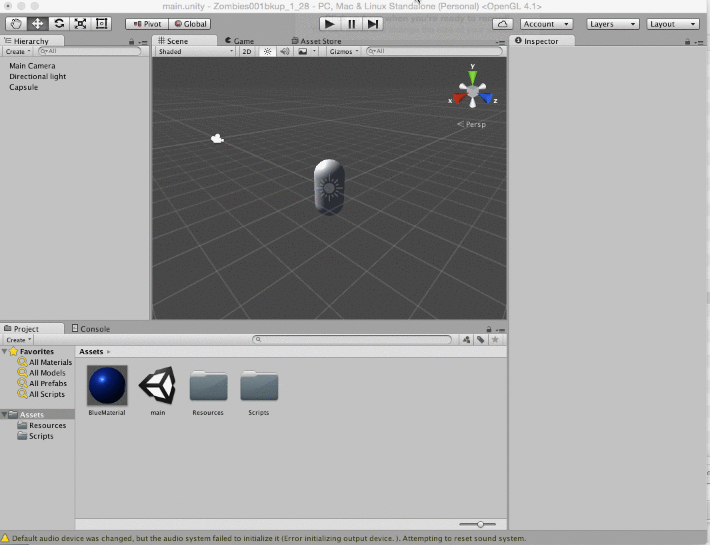

# Zombie Prefab

In our Zombie project we want to create more interesting or customized gameObjects than we can create using the default shape primitives such as Capsule.  

Primitive ZombieMesh = GameObject.CreatePrimitive(PrimitiveType.Capsule);

Instead, we will create Prefabs based on either a composite of primitive shapes, or we can create a prefab based on importing other complex assets.  It is convenient that we can dynamically spawn complex GameObjects entirely from within our custom classes by using PreFab assets.

To create a more complex prefab, we can start with a basic shape primitive like a capsule and then create additional components like a head, arms, legs...where these new gameObjects are made child objects of one parent gameObject.

###Animation: Create Material and Complex PreFab
The animation below shows how to create a new material asset, then this material is placed on a capsule, the capsule is duplicated and scaled to form a head.  Then the head is set as a child of the main capsule in the hierarchy, and finally this compound object is dragged into the Resources folder that we created.  Once in this specially named folder, we can access this prefab by it's name to dynamically spawn within our custom code.



###Instantiate Prefab In Custom Class:
        
In our project, we've created a custom C# script: Zombie class.  Within the class definition, if we define a gameObject variable like: somePrefab, we can then associate it with a prefab gameObject we have created within our Unity project.  Once we have a prefab within our Resources folder, we can use the GameObject.Instantiate() function to spawn an object using our custom prefab GameObject.  A simple example of this code is shown below:
        
```
        private GameObject SomePrefab;  // our name class prefab instance field variable
        
        //inside class constructor or other class method:
        
		SomePrefab = GameObject.Instantiate (Resources.Load ("Zombie")) as GameObject;  //prefab must be named: Zombie and located inside Resources folder within Assets folder
		SomePrefab.transform.position= new Vector3 (Random.Range (-5, 5), 0, Random.Range (-5, 5));
```